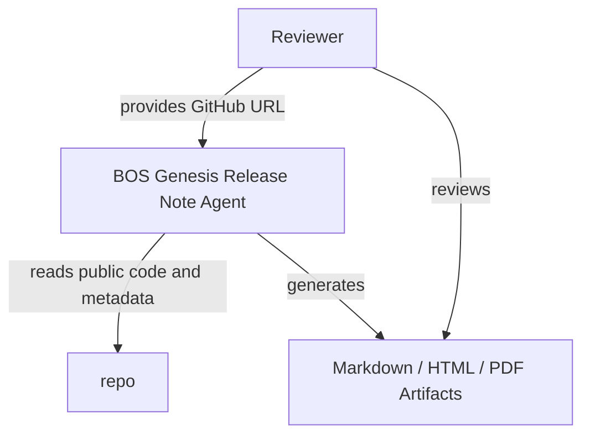
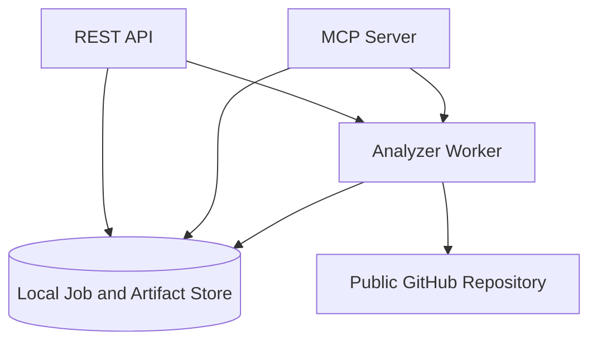
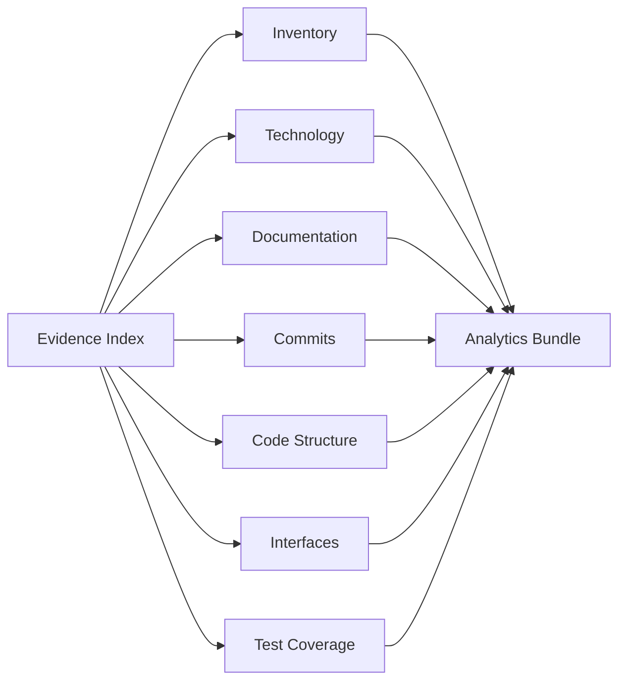
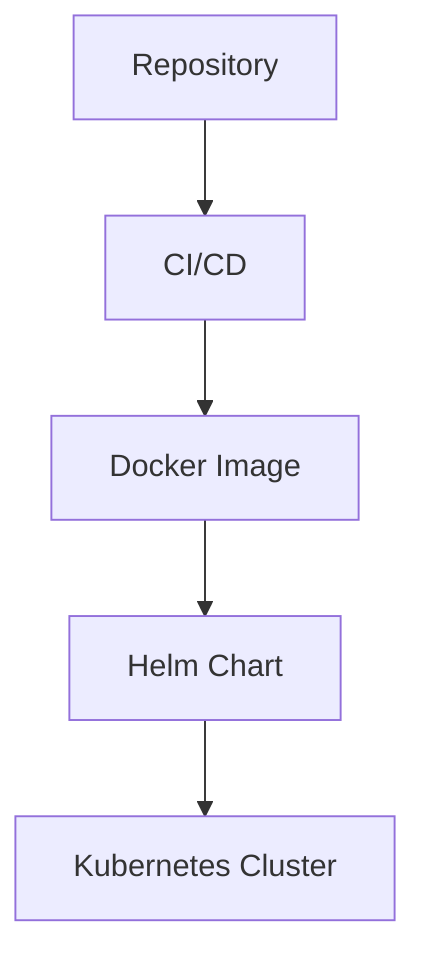

# Bosgenesis Mop Creation Agent Release Notes

## Document Control

- Release: v0.0.1
- Repository: https://github.com/aveeshek/bosgenesis-mop-creation-agent
- Generated At: 2026-06-27T18:49:42.238094+00:00
- Job ID: scan_5eb9bd86901d42f7bd8c30b5b33222de

## Executive Summary

`bosgenesis-mop-creation-agent` is a spec-first, LLM-assisted agent for reconstructing how a single BOS Genesis Kubernetes namespace was installed and generating reproducible installation documentation. Intent source: `stated`. Evidence: `ev_96de895d32fa82fcf161`.

## Release Overview

Analytics bundle generated for repository review. Missing evidence: Missing HLD documentation.; Missing LLD documentation.; No ADR documentation detected.; No coverage report evidence detected.; No module-level specs.md documentation detected.; No pytest or JUnit test report evidence detected.; Unsupported source extension for structure parsing: .sh

## Repository Overview

Section `inventory` is available with 200 evidence references.

## Project Intent

`bosgenesis-mop-creation-agent` is a spec-first, LLM-assisted agent for reconstructing how a single BOS Genesis Kubernetes namespace was installed and generating reproducible installation documentation. Intent source: `stated`. Evidence: `ev_96de895d32fa82fcf161`.

## Technology Inventory

| Technology | Category | Confidence | Evidence |
| --- | --- | ---: | --- |
| GitHub Actions | ci | 0.95 | `ev_a498032a6cf459c03f78`, `ev_e875178f835eec757266` |
| Docker | container | 0.95 | `ev_34af453e246b519e9e36` |
| Helm | deployment | 0.95 | `ev_53cdf0f9244da57a6789` |
| Kubernetes | deployment | 0.90 | `ev_52de9459e2d52dbc143c`, `ev_a8b3327396fd1a8b42c8`, `ev_56742919f7f0acd8cbc2` |
| FastAPI | framework | 0.95 | `ev_5ec09fcc74dfbefc3067` |
| MCP | framework | 0.90 | `ev_5ec09fcc74dfbefc3067` |
| Pydantic | framework | 0.95 | `ev_5ec09fcc74dfbefc3067` |
| Python | language | 0.95 | `ev_5b4fc826c0800130dbdc`, `ev_0efc6adfb196e990440e`, `ev_3451f154abcfbf94a7d8` |
| Shell | language | 0.95 | `ev_10a00996c463dacf5972`, `ev_90155e985727975ed362`, `ev_387e597dd9d5fff23d0c` |
| Ruff | linting | 0.95 | `ev_5ec09fcc74dfbefc3067` |
| Python packaging | packaging | 0.95 | `ev_5ec09fcc74dfbefc3067` |
| pytest | testing | 0.95 | `ev_5ec09fcc74dfbefc3067` |

## Architecture Overview

### Repository Analysis Flow

Repository evidence is collected before analytics and report rendering. Confidence: `0.95`.

### C4 Context

High-level context for repository scanning and release-note production. Confidence: `0.80`.

### C4 Container

Runtime containers and their main data flows. Confidence: `0.75`.

### Component Analysis

Analyzer components feeding the normalized analytics bundle. Confidence: `0.85`.

### Deployment Topology

Deployment topology derived only from detected deployment evidence. Confidence: `0.80`.

## Interface Inventory

Detected interfaces: 143.
Recommendations: No explicit CLI command contracts detected.; No explicit MCP tool contracts detected.

## Code Analytics

Section data is available with gaps. Missing evidence: Unsupported source extension for structure parsing: .sh

## Test Analytics

Test source files: 18. Parsed test reports: 0.

## Coverage Analytics

Coverage evidence is missing; no coverage percentage is reported.

## Commit Analytics

Commits analyzed: 21. Authors: 2. Changed files: 201.

## Quality and Risk Assessment

Risky areas: docs/01_SPEC_MOP_CREATION_AGENT.md, src/bosgenesis_mop_creation_agent/rendering/artifact_writer.py, src/bosgenesis_mop_creation_agent/core/orchestrator.py, docs/05_OUTPUT_CONTRACTS.md, docs/SPEC.md, charts/bosgenesis-mop-creation-agent/values.yaml, docs/04_ALGORITHM_MOP_CREATION_AGENT.md, src/bosgenesis_mop_creation_agent/api/routes.py, tests/test_phase1_contract.py, src/bosgenesis_mop_creation_agent/config/settings.py

## Known Gaps

- Missing HLD documentation.
- Missing LLD documentation.
- No ADR documentation detected.
- No coverage report evidence detected.
- No module-level specs.md documentation detected.
- No pytest or JUnit test report evidence detected.
- Unsupported source extension for structure parsing: .sh

## Evidence Traceability

| Evidence ID | Source | Summary |
| --- | --- | --- |
| `ev_00dd0e71ae725e24f664` | tests/test_phase7_pdf_renderer.py | test file tests/test_phase7_pdf_renderer.py (8692 bytes) |
| `ev_06aad13206a6a85d08ab` | memory/redis/SPEC.md | docs file memory/redis/SPEC.md (390 bytes) |
| `ev_08916f3d9cd94c5daa1e` | artifacts/human-mop/human_mop_pdf_template.md | docs file artifacts/human-mop/human_mop_pdf_template.md (11469 bytes) |
| `ev_0bfd120b132f7865a851` | src/bosgenesis_mop_creation_agent/reconstruction/models.py | source file src/bosgenesis_mop_creation_agent/reconstruction/models.py (1494 bytes) |
| `ev_0d0ca44780f98e475327` | docs/05_OUTPUT_CONTRACTS.md | docs file docs/05_OUTPUT_CONTRACTS.md (18495 bytes) |
| `ev_0efc6adfb196e990440e` | src/bosgenesis_mop_creation_agent/__main__.py | source file src/bosgenesis_mop_creation_agent/__main__.py (105 bytes) |
| `ev_100441bc0337e13650e1` | src/bosgenesis_mop_creation_agent/memory/models.py | source file src/bosgenesis_mop_creation_agent/memory/models.py (1367 bytes) |
| `ev_10a00996c463dacf5972` | playbook/deploy.sh | source file playbook/deploy.sh (8003 bytes) |
| `ev_1106f1359824c603440a` | docs/07_SAMPLE_MOP_TEMPLATE.md | docs file docs/07_SAMPLE_MOP_TEMPLATE.md (3754 bytes) |
| `ev_11a84b7bb0bd97950cf5` | src/bosgenesis_mop_creation_agent/llm/model_gateway.py | source file src/bosgenesis_mop_creation_agent/llm/model_gateway.py (3217 bytes) |
| `ev_1213505fbc1fa19fa321` | src/bosgenesis_mop_creation_agent/mcp_clients/helm_manager_client.py | source file src/bosgenesis_mop_creation_agent/mcp_clients/helm_manager_client.py (4107 bytes) |
| `ev_12ed7a520c56a86b0b1e` | src/bosgenesis_mop_creation_agent/entrypoints/__init__.py | source file src/bosgenesis_mop_creation_agent/entrypoints/__init__.py (28 bytes) |
| `ev_167ea4f9fcdfc226e61f` | src/bosgenesis_mop_creation_agent/mcp_clients/k8s_inspector_client.py | source file src/bosgenesis_mop_creation_agent/mcp_clients/k8s_inspector_client.py (7628 bytes) |
| `ev_19b9585499f34e0dde09` | tests/test_phase10_bounded_reasoning.py | test file tests/test_phase10_bounded_reasoning.py (9367 bytes) |
| `ev_1a4c8b2483ca1a310563` | src/bosgenesis_mop_creation_agent/mcp_clients/data_ingestion_client.py | source file src/bosgenesis_mop_creation_agent/mcp_clients/data_ingestion_client.py (1995 bytes) |
| `ev_1bc486c292db739af277` | tests/test_phase6_reconstruction.py | test file tests/test_phase6_reconstruction.py (14039 bytes) |
| `ev_1c41477420fee2e1c634` | src/bosgenesis_mop_creation_agent/models/requests.py | source file src/bosgenesis_mop_creation_agent/models/requests.py (2539 bytes) |
| `ev_1d58c9d94361e7f1e788` | src/bosgenesis_mop_creation_agent/memory/service.py | source file src/bosgenesis_mop_creation_agent/memory/service.py (8584 bytes) |
| `ev_1f6fa7b356296aa3cb3b` | samples/SPEC.md | docs file samples/SPEC.md (431 bytes) |
| `ev_1fad05f204ac576140fc` | playbook/rollback/SPEC.md | docs file playbook/rollback/SPEC.md (224 bytes) |
| `ev_1fd0e471f21dbb21d432` | codex/prompts/SPEC.md | docs file codex/prompts/SPEC.md (313 bytes) |
| `ev_20142773b3c8baaf07e5` | charts/bosgenesis-mop-creation-agent/templates/_helpers.tpl | deployment file charts/bosgenesis-mop-creation-agent/templates/_helpers.tpl (1481 bytes) |
| `ev_208ac95e391935684608` | codex/SPEC.md | docs file codex/SPEC.md (474 bytes) |
| `ev_21574daad08ab5c82316` | playbook/operations/SPEC.md | docs file playbook/operations/SPEC.md (259 bytes) |
| `ev_24c8cb79f2df75b3dea7` | knowledge-base/design/SPEC.md | docs file knowledge-base/design/SPEC.md (104 bytes) |
| `ev_26b8e8c89b0b87239d72` | config/SPEC.md | docs file config/SPEC.md (572 bytes) |
| `ev_2763b25cb95396521f51` | src/bosgenesis_mop_creation_agent/observability/models.py | source file src/bosgenesis_mop_creation_agent/observability/models.py (1517 bytes) |
| `ev_279f7dc54b3fc8bdce4a` | tests/test_phase1_contract.py | test file tests/test_phase1_contract.py (15627 bytes) |
| `ev_291a2ed1ec35fb2df710` | evaluations/grounding/SPEC.md | docs file evaluations/grounding/SPEC.md (161 bytes) |
| `ev_29336dbe2e37f102b48d` | charts/bosgenesis-mop-creation-agent/templates/configmap.yaml | deployment file charts/bosgenesis-mop-creation-agent/templates/configmap.yaml (779 bytes) |
| `ev_2d1b8f3cbb5373f94a21` | src/bosgenesis_mop_creation_agent/llm/models.py | source file src/bosgenesis_mop_creation_agent/llm/models.py (3526 bytes) |
| `ev_2d4566494431116e16c0` | src/bosgenesis_mop_creation_agent/evidence/SPEC.md | docs file src/bosgenesis_mop_creation_agent/evidence/SPEC.md (1421 bytes) |
| `ev_2dcbe1fb4d8d684f7785` | artifacts/SPEC.md | docs file artifacts/SPEC.md (449 bytes) |
| `ev_2e6dcbc8aa35813be862` | src/bosgenesis_mop_creation_agent/sources/SPEC.md | docs file src/bosgenesis_mop_creation_agent/sources/SPEC.md (1073 bytes) |
| `ev_3046f5e9ffcde4b3e556` | src/bosgenesis_mop_creation_agent/classification/resource_classifier.py | source file src/bosgenesis_mop_creation_agent/classification/resource_classifier.py (9076 bytes) |
| `ev_31630a7b7395b0553039` | src/bosgenesis_mop_creation_agent/mcp_clients/enrichment.py | source file src/bosgenesis_mop_creation_agent/mcp_clients/enrichment.py (9463 bytes) |
| `ev_31793097950f1d01b622` | src/bosgenesis_mop_creation_agent/api/routes.py | source file src/bosgenesis_mop_creation_agent/api/routes.py (13892 bytes) |
| `ev_31db01a017cd62a9e237` | artifacts/human-mop/SPEC.md | docs file artifacts/human-mop/SPEC.md (2238 bytes) |
| `ev_3451f154abcfbf94a7d8` | src/bosgenesis_mop_creation_agent/api/__init__.py | source file src/bosgenesis_mop_creation_agent/api/__init__.py (25 bytes) |
| `ev_34af453e246b519e9e36` | Dockerfile | deployment file Dockerfile (553 bytes) |
| `ev_355928a0bee3fa5a197d` | src/bosgenesis_mop_creation_agent/reconstruction/planner.py | source file src/bosgenesis_mop_creation_agent/reconstruction/planner.py (11834 bytes) |
| `ev_3661168bc5bc302f2934` | docs/01_SPEC_MOP_CREATION_AGENT.md | docs file docs/01_SPEC_MOP_CREATION_AGENT.md (25454 bytes) |
| `ev_387e597dd9d5fff23d0c` | playbook/uninstaller.sh | source file playbook/uninstaller.sh (3091 bytes) |
| `ev_3a553f1a1804fcc80ac8` | deploy/k8s/base/SPEC.md | deployment file deploy/k8s/base/SPEC.md (196 bytes) |
| `ev_3ab812fefc63447cae44` | docs/SPEC.md | docs file docs/SPEC.md (3905 bytes) |
| `ev_3aca6f7c37d5cf660e50` | artifacts/installation-notes/SPEC.md | docs file artifacts/installation-notes/SPEC.md (1174 bytes) |
| `ev_3b7c803b06c3fba7b23a` | charts/bosgenesis-mop-creation-agent/templates/pvc.yaml | deployment file charts/bosgenesis-mop-creation-agent/templates/pvc.yaml (680 bytes) |
| `ev_3cd32de1a42a078598bb` | codex/skills/SKILL.md | docs file codex/skills/SKILL.md (2712 bytes) |
| `ev_3dddf2dd47155d4e8129` | src/bosgenesis_mop_creation_agent/documents/SPEC.md | docs file src/bosgenesis_mop_creation_agent/documents/SPEC.md (2776 bytes) |
| `ev_4307afb87d0fbd8058eb` | src/bosgenesis_mop_creation_agent/reconstruction/command_builder.py | source file src/bosgenesis_mop_creation_agent/reconstruction/command_builder.py (2783 bytes) |
| `ev_43f71b7205345775f030` | SPEC.md | docs file SPEC.md (1808 bytes) |
| `ev_44e445aa848a7a584d0a` | src/bosgenesis_mop_creation_agent/langgraph/SPEC.md | docs file src/bosgenesis_mop_creation_agent/langgraph/SPEC.md (1505 bytes) |
| `ev_468ef1c34d0fc497fa30` | src/bosgenesis_mop_creation_agent/reconstruction/quality_gate.py | source file src/bosgenesis_mop_creation_agent/reconstruction/quality_gate.py (2454 bytes) |
| `ev_472364fa49d6c2567418` | .gitignore | config file .gitignore (218 bytes) |
| `ev_4794482bd41d163a5939` | src/bosgenesis_mop_creation_agent/classification/SPEC.md | docs file src/bosgenesis_mop_creation_agent/classification/SPEC.md (2676 bytes) |
| `ev_48a0e725109f959c376d` | src/bosgenesis_mop_creation_agent/retrieval/reference_lookup.py | source file src/bosgenesis_mop_creation_agent/retrieval/reference_lookup.py (12202 bytes) |
| `ev_48dcf833e15202f0ad55` | src/bosgenesis_mop_creation_agent/sources/clickhouse_snapshot_reader.py | source file src/bosgenesis_mop_creation_agent/sources/clickhouse_snapshot_reader.py (6669 bytes) |
| `ev_49ba58e39e62a8d4746a` | LICENSE | other file LICENSE (2417 bytes) |
| `ev_4c6e3df8de4e3e7a48fa` | src/bosgenesis_mop_creation_agent/config/settings.py | source file src/bosgenesis_mop_creation_agent/config/settings.py (15051 bytes) |
| `ev_4d902e6c5bca5e87eb10` | evaluations/safety/SPEC.md | docs file evaluations/safety/SPEC.md (161 bytes) |
| `ev_4f0b5e85b99a4890914a` | codex/config/SPEC.md | docs file codex/config/SPEC.md (186 bytes) |
| `ev_4f610612d1afb9b8ac3e` | config/settings.yaml | config file config/settings.yaml (2375 bytes) |
| `ev_50bc6531e8303fb511f1` | docs/SAMPLE_REQUESTS.md | docs file docs/SAMPLE_REQUESTS.md (5143 bytes) |
| `ev_50ecb02a856b2a2a6fca` | tests/test_phase13_observability.py | test file tests/test_phase13_observability.py (6492 bytes) |
| `ev_513d38136b0df907c611` | .agents/skills/SKILL.md | docs file .agents/skills/SKILL.md (8207 bytes) |
| `ev_51d5cd5f30a28b2168e4` | tests/test_phase5_classification.py | test file tests/test_phase5_classification.py (6655 bytes) |
| `ev_52de9459e2d52dbc143c` | charts/bosgenesis-mop-creation-agent/templates/deployment.yaml | deployment file charts/bosgenesis-mop-creation-agent/templates/deployment.yaml (2581 bytes) |
| `ev_53cdf0f9244da57a6789` | charts/bosgenesis-mop-creation-agent/Chart.yaml | deployment file charts/bosgenesis-mop-creation-agent/Chart.yaml (149 bytes) |
| `ev_56742919f7f0acd8cbc2` | charts/bosgenesis-mop-creation-agent/templates/service.yaml | deployment file charts/bosgenesis-mop-creation-agent/templates/service.yaml (428 bytes) |
| `ev_5710af8066562efdb56f` | knowledge-base/SPEC.md | docs file knowledge-base/SPEC.md (262 bytes) |
| `ev_5a0688c4f74bdbf7b325` | src/bosgenesis_mop_creation_agent/reconstruction/helm_hints.py | source file src/bosgenesis_mop_creation_agent/reconstruction/helm_hints.py (3064 bytes) |
| `ev_5a6ff06d4f123f328d26` | src/bosgenesis_mop_creation_agent/entrypoints/main.py | source file src/bosgenesis_mop_creation_agent/entrypoints/main.py (311 bytes) |
| `ev_5a9b49b8f8656066607a` | src/bosgenesis_mop_creation_agent/common/__init__.py | source file src/bosgenesis_mop_creation_agent/common/__init__.py (25 bytes) |
| `ev_5ad3fe6832dc90d2fe44` | src/bosgenesis_mop_creation_agent/retrieval/qdrant_client.py | source file src/bosgenesis_mop_creation_agent/retrieval/qdrant_client.py (4764 bytes) |
| `ev_5b34fb413968313bc2ff` | docs/03_LLD_MOP_CREATION_AGENT.md | docs file docs/03_LLD_MOP_CREATION_AGENT.md (23592 bytes) |
| `ev_5b4fc826c0800130dbdc` | src/bosgenesis_mop_creation_agent/__init__.py | source file src/bosgenesis_mop_creation_agent/__init__.py (62 bytes) |
| `ev_5e3bedb65dc51b2a1428` | playbook/deployment/SPEC.md | docs file playbook/deployment/SPEC.md (303 bytes) |
| `ev_5e5b43165f4808962310` | src/bosgenesis_mop_creation_agent/retrieval/models.py | source file src/bosgenesis_mop_creation_agent/retrieval/models.py (1771 bytes) |
| `ev_5ec09fcc74dfbefc3067` | pyproject.toml | config file pyproject.toml (1409 bytes) |
| `ev_5ee672833c32c2978d19` | src/bosgenesis_mop_creation_agent/api/mcp.py | source file src/bosgenesis_mop_creation_agent/api/mcp.py (7200 bytes) |
| `ev_5f2c8d5a8b744ac4e4d2` | docs/02_HLD_MOP_CREATION_AGENT.md | docs file docs/02_HLD_MOP_CREATION_AGENT.md (14244 bytes) |
| `ev_5f921bd4d8b745b452ad` | src/bosgenesis_mop_creation_agent/reasoning/SPEC.md | docs file src/bosgenesis_mop_creation_agent/reasoning/SPEC.md (2231 bytes) |
| `ev_5fabc4598723f1706dea` | docs/CREDENTIALS.md | docs file docs/CREDENTIALS.md (13166 bytes) |
| `ev_6026f67f4578f5854163` | tests/test_artifact_writer_inventory.py | test file tests/test_artifact_writer_inventory.py (29274 bytes) |
| `ev_603f16e9b9827c23feda` | artifacts/installation-notes/installation_notes_template.md | docs file artifacts/installation-notes/installation_notes_template.md (10092 bytes) |
| `ev_61253d07296b30a1167b` | src/bosgenesis_mop_creation_agent/entrypoints/SPEC.md | docs file src/bosgenesis_mop_creation_agent/entrypoints/SPEC.md (960 bytes) |
| `ev_6211bf49a3f3fd477356` | src/bosgenesis_mop_creation_agent/retrieval/component_query_builder.py | source file src/bosgenesis_mop_creation_agent/retrieval/component_query_builder.py (5788 bytes) |
| `ev_62af9833b6b67db6d07a` | tests/test_health.py | test file tests/test_health.py (1746 bytes) |
| `ev_65c688eb73622766d897` | docs/kubernetes-mop-sample.md | docs file docs/kubernetes-mop-sample.md (9285 bytes) |
| `ev_676e0a39c0fa4057af52` | src/bosgenesis_mop_creation_agent/llm/__init__.py | source file src/bosgenesis_mop_creation_agent/llm/__init__.py (243 bytes) |
| `ev_687d0c73974769f460e0` | samples/requests/SPEC.md | docs file samples/requests/SPEC.md (355 bytes) |
| `ev_697dd3d36d2d0496c2db` | charts/bosgenesis-mop-creation-agent/templates/secret.yaml | deployment file charts/bosgenesis-mop-creation-agent/templates/secret.yaml (560 bytes) |
| `ev_6ac26a40738fa9657465` | src/bosgenesis_mop_creation_agent/memory/SPEC.md | docs file src/bosgenesis_mop_creation_agent/memory/SPEC.md (3714 bytes) |
| `ev_6cc7510bd67366eddf7d` | src/bosgenesis_mop_creation_agent/langchain/SPEC.md | docs file src/bosgenesis_mop_creation_agent/langchain/SPEC.md (1133 bytes) |
| `ev_6cca1765e2d5c270cc43` | .agents/skills/SKILLS.md | docs file .agents/skills/SKILLS.md (9902 bytes) |
| `ev_6d2595f5d1f9f116595b` | charts/bosgenesis-mop-creation-agent/values.yaml | deployment file charts/bosgenesis-mop-creation-agent/values.yaml (5875 bytes) |
| `ev_6e0eda79f2a5752a9f37` | skills/SPEC.md | docs file skills/SPEC.md (243 bytes) |
| `ev_7161b8b0a3726dde8245` | skills/mop-creation/SPEC.md | docs file skills/mop-creation/SPEC.md (292 bytes) |
| `ev_71ff48003836f69d5ad1` | src/bosgenesis_mop_creation_agent/models/SPEC.md | docs file src/bosgenesis_mop_creation_agent/models/SPEC.md (2302 bytes) |
| `ev_73f0fa35d263b8cb2c54` | tests/test_phase15_release_candidate.py | test file tests/test_phase15_release_candidate.py (2251 bytes) |
| `ev_758909ebaebbd757e434` | src/bosgenesis_mop_creation_agent/SPEC.md | docs file src/bosgenesis_mop_creation_agent/SPEC.md (2009 bytes) |
| `ev_76309a8fc232e1b20be4` | src/bosgenesis_mop_creation_agent/rendering/pdf_renderer.py | source file src/bosgenesis_mop_creation_agent/rendering/pdf_renderer.py (39550 bytes) |
| `ev_7658e346430742726166` | src/bosgenesis_mop_creation_agent/memory/__init__.py | source file src/bosgenesis_mop_creation_agent/memory/__init__.py (267 bytes) |
| `ev_7768adedd3ded6b71f6e` | src/bosgenesis_mop_creation_agent/api/app.py | source file src/bosgenesis_mop_creation_agent/api/app.py (1172 bytes) |
| `ev_776f7bf4d4c8f1d68344` | src/bosgenesis_mop_creation_agent/config/SPEC.md | docs file src/bosgenesis_mop_creation_agent/config/SPEC.md (4578 bytes) |
| `ev_77ceb7a1949e5c89b164` | charts/SPEC.md | deployment file charts/SPEC.md (228 bytes) |
| `ev_79e211e2a105c158faaf` | src/bosgenesis_mop_creation_agent/rendering/SPEC.md | docs file src/bosgenesis_mop_creation_agent/rendering/SPEC.md (4875 bytes) |
| `ev_7dbc49687e4c1093e922` | src/bosgenesis_mop_creation_agent/observability/service.py | source file src/bosgenesis_mop_creation_agent/observability/service.py (17472 bytes) |
| `ev_8029478ff98394f073b7` | charts/bosgenesis-mop-creation-agent/SPEC.md | deployment file charts/bosgenesis-mop-creation-agent/SPEC.md (363 bytes) |
| `ev_81306cef035577ef89a0` | src/bosgenesis_mop_creation_agent/observability/SPEC.md | docs file src/bosgenesis_mop_creation_agent/observability/SPEC.md (2536 bytes) |
| `ev_8196688b70da814f6c25` | src/bosgenesis_mop_creation_agent/reconstruction/manifest_normalizer.py | source file src/bosgenesis_mop_creation_agent/reconstruction/manifest_normalizer.py (8191 bytes) |
| `ev_8516709bff9646214497` | playbook/SPEC.md | docs file playbook/SPEC.md (220 bytes) |
| `ev_85f7be7929bdecad6659` | tests/test_phase62_llm_repair.py | test file tests/test_phase62_llm_repair.py (9549 bytes) |
| `ev_87314d16b2e172e2e945` | src/bosgenesis_mop_creation_agent/core/orchestrator.py | source file src/bosgenesis_mop_creation_agent/core/orchestrator.py (36273 bytes) |
| `ev_89cf3327ff06be0ae00d` | charts/bosgenesis-mop-creation-agent/templates/SPEC.md | deployment file charts/bosgenesis-mop-creation-agent/templates/SPEC.md (218 bytes) |
| `ev_89f73e506c0b63c5758a` | docs/CONTEXT_SNAPSHOT.md | docs file docs/CONTEXT_SNAPSHOT.md (7259 bytes) |
| `ev_8a0f30e021bbd87bdc16` | .dockerignore | config file .dockerignore (103 bytes) |
| `ev_8a90716d821572828076` | src/bosgenesis_mop_creation_agent/observability/__init__.py | source file src/bosgenesis_mop_creation_agent/observability/__init__.py (213 bytes) |
| `ev_8aac16bea6b62bb2707b` | deploy/k8s/overlays/SPEC.md | deployment file deploy/k8s/overlays/SPEC.md (185 bytes) |
| `ev_8b01194b2fb91b7ec253` | tests/contracts/SPEC.md | test file tests/contracts/SPEC.md (273 bytes) |
| `ev_8b211dd789e9e193ae4c` | certs/README.md | docs file certs/README.md (740 bytes) |
| `ev_8dfeeafe8546dbfd87f9` | docs/06_APPLICATION_MODE.md | docs file docs/06_APPLICATION_MODE.md (7498 bytes) |
| `ev_8fd6e1e73cb33626070d` | tests/test_phase11_memory_layer.py | test file tests/test_phase11_memory_layer.py (7555 bytes) |
| `ev_90155e985727975ed362` | playbook/test-report.sh | source file playbook/test-report.sh (761 bytes) |
| `ev_9177de959de8f2733133` | src/bosgenesis_mop_creation_agent/classification/models.py | source file src/bosgenesis_mop_creation_agent/classification/models.py (1779 bytes) |
| `ev_918a109ec97d5040a412` | tests/test_snapshot_selector.py | test file tests/test_snapshot_selector.py (3163 bytes) |
| `ev_95d4686368032a8acd9f` | knowledge-base/interfaces/SPEC.md | docs file knowledge-base/interfaces/SPEC.md (252 bytes) |
| `ev_96de895d32fa82fcf161` | README.md | docs file README.md (4415 bytes) |
| `ev_97b03f8baa432f94f548` | src/bosgenesis_mop_creation_agent/config/__init__.py | source file src/bosgenesis_mop_creation_agent/config/__init__.py (38 bytes) |
| `ev_9898aed47a105b0750fd` | src/bosgenesis_mop_creation_agent/core/__init__.py | source file src/bosgenesis_mop_creation_agent/core/__init__.py (35 bytes) |
| `ev_98acc276eefe8dffd3a4` | knowledge-base/schemas/SPEC.md | docs file knowledge-base/schemas/SPEC.md (196 bytes) |
| `ev_9947368aa5cbe17d2948` | src/bosgenesis_mop_creation_agent/reconstruction/__init__.py | source file src/bosgenesis_mop_creation_agent/reconstruction/__init__.py (132 bytes) |
| `ev_99e1023a6f630b017cba` | src/bosgenesis_mop_creation_agent/retrieval/SPEC.md | docs file src/bosgenesis_mop_creation_agent/retrieval/SPEC.md (1991 bytes) |
| `ev_9b93737f4a1bb662f17f` | src/SPEC.md | docs file src/SPEC.md (2511 bytes) |
| `ev_9c0cd0d4489aa66cf255` | src/bosgenesis_mop_creation_agent/llm/repair_suggester.py | source file src/bosgenesis_mop_creation_agent/llm/repair_suggester.py (11083 bytes) |
| `ev_9cea093a97dd0af3e6db` | AGENTS.md | docs file AGENTS.md (1880 bytes) |
| `ev_9d585ec079ef55a2c129` | src/bosgenesis_mop_creation_agent/common/SPEC.md | docs file src/bosgenesis_mop_creation_agent/common/SPEC.md (714 bytes) |
| `ev_9f2721f52c51715be694` | src/bosgenesis_mop_creation_agent/reconstruction/SPEC.md | docs file src/bosgenesis_mop_creation_agent/reconstruction/SPEC.md (1637 bytes) |
| `ev_a2c3d0769629d1b85b39` | PROJECT_STRUCTURE.md | docs file PROJECT_STRUCTURE.md (1340 bytes) |
| `ev_a35883b4d18a738d88a0` | src/bosgenesis_mop_creation_agent/api/SPEC.md | docs file src/bosgenesis_mop_creation_agent/api/SPEC.md (5261 bytes) |
| `ev_a498032a6cf459c03f78` | .github/workflows/SPEC.md | ci file .github/workflows/SPEC.md (574 bytes) |
| `ev_a8b3327396fd1a8b42c8` | charts/bosgenesis-mop-creation-agent/templates/ingress.yaml | deployment file charts/bosgenesis-mop-creation-agent/templates/ingress.yaml (991 bytes) |
| `ev_a95f58a0ec9f5551d89a` | tests/test_phase4_mcp_enrichment.py | test file tests/test_phase4_mcp_enrichment.py (10444 bytes) |
| `ev_abf7468415d4417f1618` | tests/e2e/SPEC.md | test file tests/e2e/SPEC.md (294 bytes) |
| `ev_aeb0d2c41486b835d1bf` | memory/clickhouse/SPEC.md | docs file memory/clickhouse/SPEC.md (318 bytes) |
| `ev_af5e315683fd5e26d3ac` | src/bosgenesis_mop_creation_agent/llm/SPEC.md | docs file src/bosgenesis_mop_creation_agent/llm/SPEC.md (5822 bytes) |
| `ev_afb6fd4a4d557c25c885` | memory/langmem/SPEC.md | docs file memory/langmem/SPEC.md (275 bytes) |
| `ev_b1a655dbeb3974ec0d99` | charts/bosgenesis-mop-creation-agent/values/SPEC.md | deployment file charts/bosgenesis-mop-creation-agent/values/SPEC.md (310 bytes) |
| `ev_b4214b16e206885ae0c7` | src/bosgenesis_mop_creation_agent/application/SPEC.md | docs file src/bosgenesis_mop_creation_agent/application/SPEC.md (1429 bytes) |
| `ev_b5afcc0398ed0bbda2ab` | deploy/k8s/SPEC.md | deployment file deploy/k8s/SPEC.md (219 bytes) |
| `ev_b6b1d535919a07c4386e` | memory/postgresql/SPEC.md | docs file memory/postgresql/SPEC.md (477 bytes) |
| `ev_b737958289c21beb3250` | tests/fixtures/SPEC.md | test file tests/fixtures/SPEC.md (231 bytes) |
| `ev_b8e6a0b98dba62edf9b1` | samples/requests/platform-only-generate.json | config file samples/requests/platform-only-generate.json (379 bytes) |
| `ev_bdf64f600e9aadb88263` | src/bosgenesis_mop_creation_agent/common/logging.py | source file src/bosgenesis_mop_creation_agent/common/logging.py (1803 bytes) |
| `ev_be809ec7b3dfffa9283d` | samples/requests/application-mode-smoke-generate.json | config file samples/requests/application-mode-smoke-generate.json (388 bytes) |
| `ev_beb267943caae96b4497` | reports/.gitkeep | other file reports/.gitkeep (1 bytes) |
| `ev_bed70de4f6d44cfc7963` | TECH_STACK.md | docs file TECH_STACK.md (1192 bytes) |
| `ev_c02720c88556d60f5b77` | src/bosgenesis_mop_creation_agent/collectors/SPEC.md | docs file src/bosgenesis_mop_creation_agent/collectors/SPEC.md (1181 bytes) |
| `ev_c08e83d1dd3d2769fcf9` | knowledge-base/session/SPEC.md | docs file knowledge-base/session/SPEC.md (199 bytes) |
| `ev_c0f6d8d68d4f8d3e412a` | src/bosgenesis_mop_creation_agent/models/__init__.py | source file src/bosgenesis_mop_creation_agent/models/__init__.py (37 bytes) |
| `ev_c1bcab801ff60dee5e10` | tests/test_phase9_qdrant_references.py | test file tests/test_phase9_qdrant_references.py (9989 bytes) |
| `ev_c353b41747bbeca3ef2c` | src/bosgenesis_mop_creation_agent/models/responses.py | source file src/bosgenesis_mop_creation_agent/models/responses.py (2024 bytes) |
| `ev_c40d3c4b9ce3d87743b3` | certs/.gitkeep | other file certs/.gitkeep (1 bytes) |
| `ev_c5ffd7537bd9205ef96c` | playbook/validation/SPEC.md | docs file playbook/validation/SPEC.md (300 bytes) |
| `ev_c71b17a9b08bf3f54e33` | memory/mongodb/SPEC.md | docs file memory/mongodb/SPEC.md (277 bytes) |
| `ev_c723e7839de82ad1ff41` | knowledge-base/decisions/SPEC.md | docs file knowledge-base/decisions/SPEC.md (192 bytes) |
| `ev_c9e0cdc92b57b872e769` | .agents/skills/SPEC.md | docs file .agents/skills/SPEC.md (265 bytes) |
| `ev_cc792a204602b553eb28` | artifacts/human-mop/professional_mop_pdf_template.yaml | config file artifacts/human-mop/professional_mop_pdf_template.yaml (1794 bytes) |
| `ev_d04e9b42eabafab2ec47` | src/bosgenesis_mop_creation_agent/security/SPEC.md | docs file src/bosgenesis_mop_creation_agent/security/SPEC.md (1567 bytes) |
| `ev_d3c02fb00c8cc0fe6f3e` | evaluations/SPEC.md | docs file evaluations/SPEC.md (303 bytes) |
| `ev_d4ecb3c23de6cfa6d817` | playbook/test-report.ps1 | other file playbook/test-report.ps1 (958 bytes) |
| `ev_d789607a82babc631508` | src/bosgenesis_mop_creation_agent/sources/snapshot_selector.py | source file src/bosgenesis_mop_creation_agent/sources/snapshot_selector.py (3372 bytes) |
| `ev_d7dd8bc994a7f95c7df4` | src/bosgenesis_mop_creation_agent/mcp_clients/SPEC.md | docs file src/bosgenesis_mop_creation_agent/mcp_clients/SPEC.md (1594 bytes) |
| `ev_dbb81fc79a502f9cb4f6` | tests/SPEC.md | test file tests/SPEC.md (1442 bytes) |
| `ev_dc69ff4118815c57733f` | codex/skills/SPEC.md | docs file codex/skills/SPEC.md (221 bytes) |
| `ev_dd3a25e9b3d1c543aea3` | reports/SPEC.md | docs file reports/SPEC.md (901 bytes) |
| `ev_de41d60c78f466a3fbf8` | src/bosgenesis_mop_creation_agent/retrieval/__init__.py | source file src/bosgenesis_mop_creation_agent/retrieval/__init__.py (258 bytes) |
| `ev_df0a43aa32b10f2ac70f` | codex/config/config.toml | config file codex/config/config.toml (937 bytes) |
| `ev_e12ef2c2fcc9993d2f33` | docs/RELEASE_CANDIDATE_RUNBOOK.md | docs file docs/RELEASE_CANDIDATE_RUNBOOK.md (7686 bytes) |
| `ev_e15a89cfdb9b220477b1` | src/bosgenesis_mop_creation_agent/sources/snapshot_models.py | source file src/bosgenesis_mop_creation_agent/sources/snapshot_models.py (1811 bytes) |
| `ev_e34f4a4a9cb4c4f2a5cd` | src/bosgenesis_mop_creation_agent/memory/adapters.py | source file src/bosgenesis_mop_creation_agent/memory/adapters.py (12648 bytes) |
| `ev_e3b4f3a504d89c523bb6` | deploy/SPEC.md | deployment file deploy/SPEC.md (199 bytes) |
| `ev_e51e2c667a79f131e3b3` | src/bosgenesis_mop_creation_agent/rendering/artifact_writer.py | source file src/bosgenesis_mop_creation_agent/rendering/artifact_writer.py (88609 bytes) |
| `ev_e6597f068d376b2ed484` | src/bosgenesis_mop_creation_agent/persistence/SPEC.md | docs file src/bosgenesis_mop_creation_agent/persistence/SPEC.md (1919 bytes) |
| `ev_e7976e2d144b9fce326f` | charts/bosgenesis-mop-creation-agent/values.credentials.example.yaml | deployment file charts/bosgenesis-mop-creation-agent/values.credentials.example.yaml (596 bytes) |
| `ev_e865671bdbe206ee3f0b` | docs/DEPLOYMENT.md | docs file docs/DEPLOYMENT.md (3993 bytes) |
| `ev_e875178f835eec757266` | .github/workflows/ci.yml | ci file .github/workflows/ci.yml (1079 bytes) |
| `ev_e9d92c91ba0402358aae` | src/bosgenesis_mop_creation_agent/core/SPEC.md | docs file src/bosgenesis_mop_creation_agent/core/SPEC.md (4204 bytes) |
| `ev_efbc367a7a7761c1f5ad` | src/bosgenesis_mop_creation_agent/sources/postgres_snapshot_reader.py | source file src/bosgenesis_mop_creation_agent/sources/postgres_snapshot_reader.py (7148 bytes) |
| `ev_eff74d125226a95cd9c3` | src/bosgenesis_mop_creation_agent/validation/SPEC.md | docs file src/bosgenesis_mop_creation_agent/validation/SPEC.md (1964 bytes) |
| `ev_f21879538f3c89eba7b6` | charts/bosgenesis-mop-creation-agent/.helmignore | deployment file charts/bosgenesis-mop-creation-agent/.helmignore (65 bytes) |
| `ev_f24d54df6974fe967a6e` | docs/K8S_INSPECTOR_RESOURCE_DETAIL_ENRICHMENT_PLAN.md | docs file docs/K8S_INSPECTOR_RESOURCE_DETAIL_ENRICHMENT_PLAN.md (8029 bytes) |
| `ev_f466fac7f0df39af8f68` | src/bosgenesis_mop_creation_agent/reconstruction/helm_values.py | source file src/bosgenesis_mop_creation_agent/reconstruction/helm_values.py (2361 bytes) |
| `ev_f74fb512832e7200095a` | src/bosgenesis_mop_creation_agent/mcp_clients/base.py | source file src/bosgenesis_mop_creation_agent/mcp_clients/base.py (8295 bytes) |
| `ev_f8cf12426ead914f32c5` | docs/04_ALGORITHM_MOP_CREATION_AGENT.md | docs file docs/04_ALGORITHM_MOP_CREATION_AGENT.md (28900 bytes) |
| `ev_f927deb932e34a781ff6` | certs/SPEC.md | docs file certs/SPEC.md (1369 bytes) |
| `ev_fa35dc0de8bee73d0faa` | src/bosgenesis_mop_creation_agent/classification/__init__.py | source file src/bosgenesis_mop_creation_agent/classification/__init__.py (357 bytes) |
| `ev_fb2c275d502e4f48751d` | src/bosgenesis_mop_creation_agent/llm/bounded_reasoning.py | source file src/bosgenesis_mop_creation_agent/llm/bounded_reasoning.py (15011 bytes) |
| `ev_fb4400fa7a7c1aecc384` | memory/SPEC.md | docs file memory/SPEC.md (631 bytes) |
| `ev_fcd819c6a23e632d9b8c` | .github/SPEC.md | docs file .github/SPEC.md (272 bytes) |

## Appendix

Generated by BOS Genesis Release Note Agent.

## Summary
Release-note-agent document preserved as the primary draft.

## Source Evidence
- GitHub URL: https://github.com/aveeshek/bosgenesis-mop-creation-agent
- release-note-agent status: `success`

## Repository Scan
- Repository: https://github.com/aveeshek/bosgenesis-mop-creation-agent
- Source ref: tag phase16.2-final-clone-reconstruction
- Clone status: `success`
- Primary language: `python`
- Files inspected: 91 code file(s), 2 manifest(s)
- Local checkout cleanup: `removed`

### Vulnerability Matrix
| Category | Severity | Findings | Evidence | Recommendation |
| --- | --- | ---: | --- | --- |
| Cryptography | medium | 2 | src/bosgenesis_mop_creation_agent/reconstruction/planner.py:195 (weak_hash) | Use SHA-256 or stronger algorithms unless this is non-security hashing. |

### Code Quality Matrix
| Area | Tool | Result | Findings | Notes |
| --- | --- | --- | ---: | --- |
| Language mix | repository inventory | python | 91 | Detected 2 dependency/build manifest(s). |
| Code quality | ruff | completed | 0 | pylint was unavailable; ruff was used as fallback. |
| Quality categories | ruff | summarized | 0 | lint: 0 |

### LLM Security Review Summary
- Overall risk: `low`
- Summary: The static scan identified a narrow cryptography theme: two instances of SHA‑1 usage for generating short digests. No secrets exposure, lint issues, or additional high/critical findings were reported. Given the limited scope and likely non-security context of the hashing (short IDs), the current risk is low, but it could rise if those digests are used for any security-sensitive function (e.g., integrity, authentication, access control).
- Safe reasoning summary: - Findings are concentrated in a single category (cryptography) with two medium-severity instances of SHA‑1 used to derive short identifiers.
- Truncation to 8 characters increases collision likelihood; acceptability depends on whether the value is used purely for non-security naming versus enforcing uniqueness or trust.
- No secrets or hardcoded credentials were flagged; quality checks reported no issues; manifests are present but dependency risk was not assessed in this scan.
- No other common vulnerability classes (injection, deserialization, SSRF, path traversal, misconfig) surfaced in the provided results.
