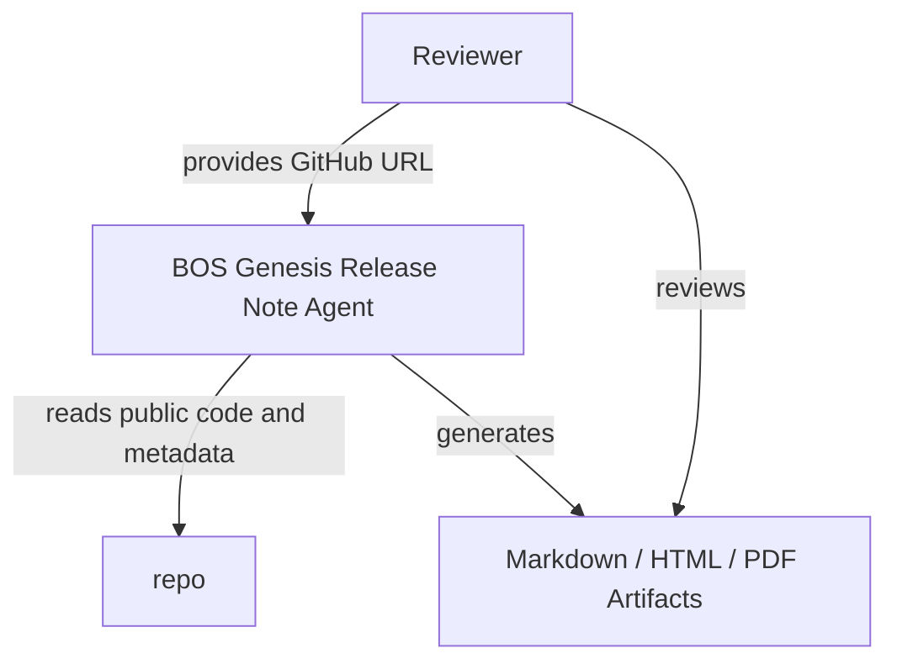
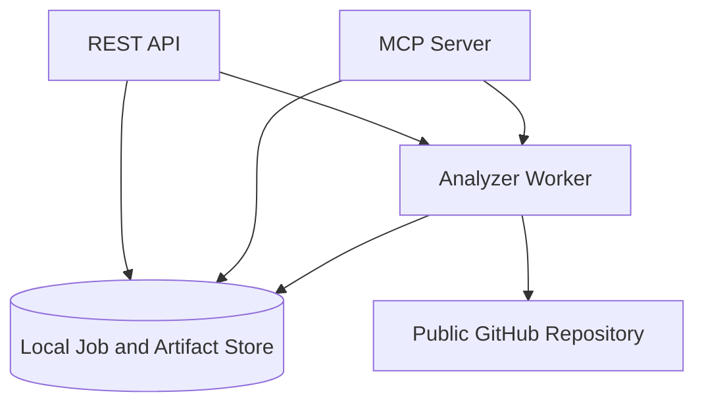
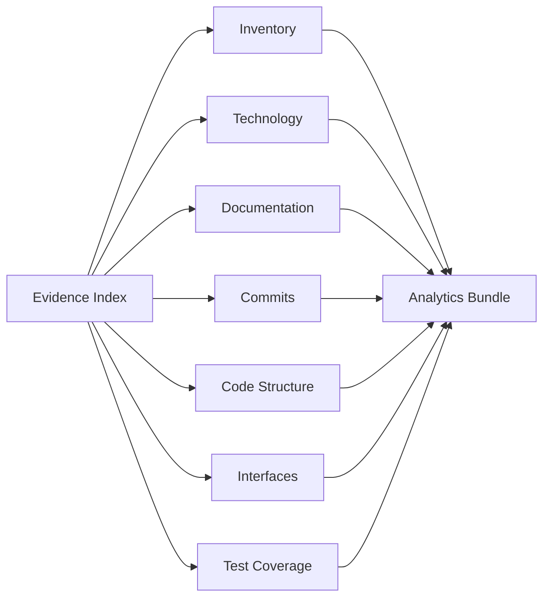
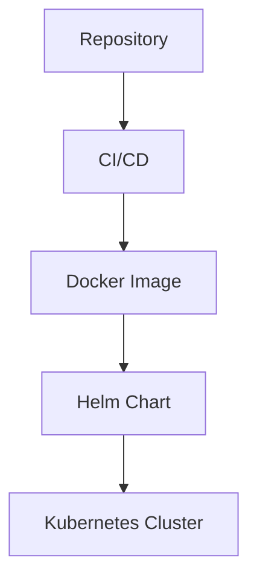

# Bosgenesis Mop Creation Agent Release Notes

## Document Control

- Release: v0.0.1
- Repository: https://github.com/aveeshek/bosgenesis-mop-creation-agent
- Generated At: 2026-07-05T01:59:38.201434+00:00
- Job ID: scan_d63774acfc0643a6b3c3e2b327db8fea

## Executive Summary

`bosgenesis-mop-creation-agent` is a spec-first, LLM-assisted agent for reconstructing how a single BOS Genesis Kubernetes namespace was installed and generating reproducible installation documentation. Intent source: `stated`. Evidence: `ev_84aac8afe64ceaa69b71`.

## Release Overview

Analytics bundle generated for repository review. Missing evidence: Missing HLD documentation.; Missing LLD documentation.; No ADR documentation detected.; No coverage report evidence detected.; No module-level specs.md documentation detected.; No pytest or JUnit test report evidence detected.; Unsupported source extension for structure parsing: .sh

## Repository Overview

Section `inventory` is available with 200 evidence references.

## Project Intent

`bosgenesis-mop-creation-agent` is a spec-first, LLM-assisted agent for reconstructing how a single BOS Genesis Kubernetes namespace was installed and generating reproducible installation documentation. Intent source: `stated`. Evidence: `ev_84aac8afe64ceaa69b71`.

## Technology Inventory

| Technology | Category | Confidence | Evidence |
| --- | --- | ---: | --- |
| GitHub Actions | ci | 0.95 | `ev_ae72ff4e0cae4e65ad33`, `ev_b1fb680451ab320d92fc` |
| Docker | container | 0.95 | `ev_41966f9b56dab9feba18` |
| Helm | deployment | 0.95 | `ev_aac806e9fadd1665a93a` |
| Kubernetes | deployment | 0.90 | `ev_d191a9bf7fbc6df23577`, `ev_ebb4b194385951c02235`, `ev_4a24658c58302aaf2f21` |
| FastAPI | framework | 0.95 | `ev_7041d61bc799942dc078` |
| MCP | framework | 0.90 | `ev_7041d61bc799942dc078` |
| Pydantic | framework | 0.95 | `ev_7041d61bc799942dc078` |
| Python | language | 0.95 | `ev_6b5aaea5a12c1ff83b5a`, `ev_50a232b705b5ae4b74f2`, `ev_797ab90448d9be571d4a` |
| Shell | language | 0.95 | `ev_c82c6739e329a22dbf14`, `ev_e0bc867692b44c52a169`, `ev_0fba16cf37d9f9480557` |
| Ruff | linting | 0.95 | `ev_7041d61bc799942dc078` |
| Python packaging | packaging | 0.95 | `ev_7041d61bc799942dc078` |
| pytest | testing | 0.95 | `ev_7041d61bc799942dc078` |

## Architecture Overview

### Repository Analysis Flow

Repository evidence is collected before analytics and report rendering. Confidence: `0.95`.

### C4 Context

High-level context for repository scanning and release-note production. Confidence: `0.80`.

### C4 Container

Runtime containers and their main data flows. Confidence: `0.75`.

### Component Analysis

Analyzer components feeding the normalized analytics bundle. Confidence: `0.85`.

### Deployment Topology

Deployment topology derived only from detected deployment evidence. Confidence: `0.80`.

## Interface Inventory

Detected interfaces: 143.
Recommendations: No explicit CLI command contracts detected.; No explicit MCP tool contracts detected.

## Code Analytics

Section data is available with gaps. Missing evidence: Unsupported source extension for structure parsing: .sh

## Test Analytics

Test source files: 18. Parsed test reports: 0.

## Coverage Analytics

Coverage evidence is missing; no coverage percentage is reported.

## Commit Analytics

Commits analyzed: 21. Authors: 2. Changed files: 201.

## Quality and Risk Assessment

Risky areas: docs/01_SPEC_MOP_CREATION_AGENT.md, src/bosgenesis_mop_creation_agent/rendering/artifact_writer.py, src/bosgenesis_mop_creation_agent/core/orchestrator.py, docs/05_OUTPUT_CONTRACTS.md, docs/SPEC.md, charts/bosgenesis-mop-creation-agent/values.yaml, docs/04_ALGORITHM_MOP_CREATION_AGENT.md, src/bosgenesis_mop_creation_agent/api/routes.py, tests/test_phase1_contract.py, src/bosgenesis_mop_creation_agent/config/settings.py

## Known Gaps

- Missing HLD documentation.
- Missing LLD documentation.
- No ADR documentation detected.
- No coverage report evidence detected.
- No module-level specs.md documentation detected.
- No pytest or JUnit test report evidence detected.
- Unsupported source extension for structure parsing: .sh

## Evidence Traceability

| Evidence ID | Source | Summary |
| --- | --- | --- |
| `ev_05c5b314fa186d4dbe3f` | src/bosgenesis_mop_creation_agent/validation/SPEC.md | docs file src/bosgenesis_mop_creation_agent/validation/SPEC.md (1964 bytes) |
| `ev_067a840abf2c9602bd36` | docs/RELEASE_CANDIDATE_RUNBOOK.md | docs file docs/RELEASE_CANDIDATE_RUNBOOK.md (7686 bytes) |
| `ev_087db75b662298c4ec86` | src/bosgenesis_mop_creation_agent/api/app.py | source file src/bosgenesis_mop_creation_agent/api/app.py (1172 bytes) |
| `ev_09b7e46e6ebb51e2c438` | .dockerignore | config file .dockerignore (103 bytes) |
| `ev_0baa2b2b6d29bd74f3fa` | reports/SPEC.md | docs file reports/SPEC.md (901 bytes) |
| `ev_0e3367a5fa1321c7d383` | src/bosgenesis_mop_creation_agent/retrieval/qdrant_client.py | source file src/bosgenesis_mop_creation_agent/retrieval/qdrant_client.py (4764 bytes) |
| `ev_0ec06a60b03eac36e592` | src/bosgenesis_mop_creation_agent/observability/__init__.py | source file src/bosgenesis_mop_creation_agent/observability/__init__.py (213 bytes) |
| `ev_0ef6d9e31da5de8d24a6` | tests/test_snapshot_selector.py | test file tests/test_snapshot_selector.py (3163 bytes) |
| `ev_0fba16cf37d9f9480557` | playbook/uninstaller.sh | source file playbook/uninstaller.sh (3091 bytes) |
| `ev_13e44a1bb20d28b2d2a9` | src/bosgenesis_mop_creation_agent/llm/model_gateway.py | source file src/bosgenesis_mop_creation_agent/llm/model_gateway.py (3217 bytes) |
| `ev_1437f98fc16e8f2720bc` | docs/02_HLD_MOP_CREATION_AGENT.md | docs file docs/02_HLD_MOP_CREATION_AGENT.md (14244 bytes) |
| `ev_1524fb254b81a750867b` | src/bosgenesis_mop_creation_agent/classification/__init__.py | source file src/bosgenesis_mop_creation_agent/classification/__init__.py (357 bytes) |
| `ev_1535125b3922e62bc4d5` | docs/CONTEXT_SNAPSHOT.md | docs file docs/CONTEXT_SNAPSHOT.md (7259 bytes) |
| `ev_197fe355041d981d18db` | src/bosgenesis_mop_creation_agent/memory/service.py | source file src/bosgenesis_mop_creation_agent/memory/service.py (8584 bytes) |
| `ev_1b92ef9b3fcad9a8824f` | memory/langmem/SPEC.md | docs file memory/langmem/SPEC.md (275 bytes) |
| `ev_1c4177b989991e47761a` | src/bosgenesis_mop_creation_agent/llm/repair_suggester.py | source file src/bosgenesis_mop_creation_agent/llm/repair_suggester.py (11083 bytes) |
| `ev_20f47e00504cc1703eca` | src/bosgenesis_mop_creation_agent/config/SPEC.md | docs file src/bosgenesis_mop_creation_agent/config/SPEC.md (4578 bytes) |
| `ev_20fd28ef9cb5e9baf040` | charts/bosgenesis-mop-creation-agent/templates/configmap.yaml | deployment file charts/bosgenesis-mop-creation-agent/templates/configmap.yaml (779 bytes) |
| `ev_2256d69a12758fac5fc7` | SPEC.md | docs file SPEC.md (1808 bytes) |
| `ev_22e16b42e824cd17fd4c` | tests/fixtures/SPEC.md | test file tests/fixtures/SPEC.md (231 bytes) |
| `ev_2a00ffb57877825bdf1d` | memory/mongodb/SPEC.md | docs file memory/mongodb/SPEC.md (277 bytes) |
| `ev_2a4c60941c04957051a8` | memory/SPEC.md | docs file memory/SPEC.md (631 bytes) |
| `ev_2a981d4f6e5517160e73` | deploy/k8s/SPEC.md | deployment file deploy/k8s/SPEC.md (219 bytes) |
| `ev_2acf4e0cd927adba3182` | src/bosgenesis_mop_creation_agent/retrieval/__init__.py | source file src/bosgenesis_mop_creation_agent/retrieval/__init__.py (258 bytes) |
| `ev_2d945e61f85bef198c2b` | docs/05_OUTPUT_CONTRACTS.md | docs file docs/05_OUTPUT_CONTRACTS.md (18495 bytes) |
| `ev_304d96a550fe599892d6` | playbook/operations/SPEC.md | docs file playbook/operations/SPEC.md (259 bytes) |
| `ev_332f829153940ac3e292` | codex/prompts/SPEC.md | docs file codex/prompts/SPEC.md (313 bytes) |
| `ev_36c62420f62262f76420` | docs/07_SAMPLE_MOP_TEMPLATE.md | docs file docs/07_SAMPLE_MOP_TEMPLATE.md (3754 bytes) |
| `ev_3af39f8e5b78b8bb8aa2` | src/bosgenesis_mop_creation_agent/reconstruction/quality_gate.py | source file src/bosgenesis_mop_creation_agent/reconstruction/quality_gate.py (2454 bytes) |
| `ev_3f950f410fecdab37412` | tests/test_phase6_reconstruction.py | test file tests/test_phase6_reconstruction.py (14039 bytes) |
| `ev_41966f9b56dab9feba18` | Dockerfile | deployment file Dockerfile (553 bytes) |
| `ev_43bfe020f39b97859819` | samples/requests/application-mode-smoke-generate.json | config file samples/requests/application-mode-smoke-generate.json (388 bytes) |
| `ev_4463b2e2f323a975d16d` | src/bosgenesis_mop_creation_agent/application/SPEC.md | docs file src/bosgenesis_mop_creation_agent/application/SPEC.md (1429 bytes) |
| `ev_4487970d7cb93414bd1a` | skills/mop-creation/SPEC.md | docs file skills/mop-creation/SPEC.md (292 bytes) |
| `ev_44a6b5e800668dfd9969` | knowledge-base/SPEC.md | docs file knowledge-base/SPEC.md (262 bytes) |
| `ev_4616cd61149a6120d34d` | artifacts/human-mop/human_mop_pdf_template.md | docs file artifacts/human-mop/human_mop_pdf_template.md (11469 bytes) |
| `ev_47c20139a70f65ac6de8` | src/bosgenesis_mop_creation_agent/memory/__init__.py | source file src/bosgenesis_mop_creation_agent/memory/__init__.py (267 bytes) |
| `ev_48edcf8dbb0615dec4cc` | tests/e2e/SPEC.md | test file tests/e2e/SPEC.md (294 bytes) |
| `ev_4a24658c58302aaf2f21` | charts/bosgenesis-mop-creation-agent/templates/service.yaml | deployment file charts/bosgenesis-mop-creation-agent/templates/service.yaml (428 bytes) |
| `ev_4abdb72cb1abfe2a433b` | charts/bosgenesis-mop-creation-agent/templates/secret.yaml | deployment file charts/bosgenesis-mop-creation-agent/templates/secret.yaml (560 bytes) |
| `ev_4c40604b683af31251a9` | .github/SPEC.md | docs file .github/SPEC.md (272 bytes) |
| `ev_4c6668c50c2809180fe4` | src/bosgenesis_mop_creation_agent/models/SPEC.md | docs file src/bosgenesis_mop_creation_agent/models/SPEC.md (2302 bytes) |
| `ev_4d091b79b625ce30c6a3` | src/bosgenesis_mop_creation_agent/api/SPEC.md | docs file src/bosgenesis_mop_creation_agent/api/SPEC.md (5261 bytes) |
| `ev_4dfc10c3024155492457` | tests/test_phase5_classification.py | test file tests/test_phase5_classification.py (6655 bytes) |
| `ev_4dfc4cb00af8a1f76c82` | src/bosgenesis_mop_creation_agent/llm/bounded_reasoning.py | source file src/bosgenesis_mop_creation_agent/llm/bounded_reasoning.py (15011 bytes) |
| `ev_4f1e2c0c5f2b11380296` | codex/skills/SPEC.md | docs file codex/skills/SPEC.md (221 bytes) |
| `ev_5062ff51959e1fc4120b` | src/bosgenesis_mop_creation_agent/mcp_clients/enrichment.py | source file src/bosgenesis_mop_creation_agent/mcp_clients/enrichment.py (9463 bytes) |
| `ev_50a232b705b5ae4b74f2` | src/bosgenesis_mop_creation_agent/__main__.py | source file src/bosgenesis_mop_creation_agent/__main__.py (105 bytes) |
| `ev_50dd200f26e17371e5b6` | codex/skills/SKILL.md | docs file codex/skills/SKILL.md (2712 bytes) |
| `ev_5383aa6e4a10e2748030` | LICENSE | other file LICENSE (2417 bytes) |
| `ev_566ba4bd1aae58a63f9b` | src/bosgenesis_mop_creation_agent/sources/postgres_snapshot_reader.py | source file src/bosgenesis_mop_creation_agent/sources/postgres_snapshot_reader.py (7148 bytes) |
| `ev_58e0244ad40463cc7120` | codex/config/config.toml | config file codex/config/config.toml (937 bytes) |
| `ev_5abb6a119a3dd0d6acf2` | src/bosgenesis_mop_creation_agent/reconstruction/SPEC.md | docs file src/bosgenesis_mop_creation_agent/reconstruction/SPEC.md (1637 bytes) |
| `ev_5dae7a26a6e9b99085ca` | .gitignore | config file .gitignore (218 bytes) |
| `ev_5e30757fe1884958b133` | src/bosgenesis_mop_creation_agent/classification/SPEC.md | docs file src/bosgenesis_mop_creation_agent/classification/SPEC.md (2676 bytes) |
| `ev_5ec2ee8de998b91db385` | src/bosgenesis_mop_creation_agent/documents/SPEC.md | docs file src/bosgenesis_mop_creation_agent/documents/SPEC.md (2776 bytes) |
| `ev_62fb5e79b4a401ee6c9f` | src/bosgenesis_mop_creation_agent/common/logging.py | source file src/bosgenesis_mop_creation_agent/common/logging.py (1803 bytes) |
| `ev_630c06be5527b0959e13` | src/bosgenesis_mop_creation_agent/observability/service.py | source file src/bosgenesis_mop_creation_agent/observability/service.py (17472 bytes) |
| `ev_63c4a3dbadb8d00582c1` | knowledge-base/interfaces/SPEC.md | docs file knowledge-base/interfaces/SPEC.md (252 bytes) |
| `ev_63f21112f4edf5455fa3` | src/bosgenesis_mop_creation_agent/observability/SPEC.md | docs file src/bosgenesis_mop_creation_agent/observability/SPEC.md (2536 bytes) |
| `ev_6465184a37a17aa2cfc8` | docs/SAMPLE_REQUESTS.md | docs file docs/SAMPLE_REQUESTS.md (5143 bytes) |
| `ev_64775ae5a26cd797718d` | samples/requests/SPEC.md | docs file samples/requests/SPEC.md (355 bytes) |
| `ev_6506ee745d24ab0dc887` | src/bosgenesis_mop_creation_agent/collectors/SPEC.md | docs file src/bosgenesis_mop_creation_agent/collectors/SPEC.md (1181 bytes) |
| `ev_66a5bc7c2ca6a1951982` | docs/K8S_INSPECTOR_RESOURCE_DETAIL_ENRICHMENT_PLAN.md | docs file docs/K8S_INSPECTOR_RESOURCE_DETAIL_ENRICHMENT_PLAN.md (8029 bytes) |
| `ev_6829619b4c9a227b20ff` | certs/SPEC.md | docs file certs/SPEC.md (1369 bytes) |
| `ev_6864be2d54a09fbb60a0` | src/SPEC.md | docs file src/SPEC.md (2511 bytes) |
| `ev_6addcc8fe2b54e628763` | src/bosgenesis_mop_creation_agent/mcp_clients/data_ingestion_client.py | source file src/bosgenesis_mop_creation_agent/mcp_clients/data_ingestion_client.py (1995 bytes) |
| `ev_6b5aaea5a12c1ff83b5a` | src/bosgenesis_mop_creation_agent/__init__.py | source file src/bosgenesis_mop_creation_agent/__init__.py (62 bytes) |
| `ev_6c34314033a5ff9dae58` | charts/bosgenesis-mop-creation-agent/values.credentials.example.yaml | deployment file charts/bosgenesis-mop-creation-agent/values.credentials.example.yaml (596 bytes) |
| `ev_6d371954597e580014f9` | src/bosgenesis_mop_creation_agent/core/__init__.py | source file src/bosgenesis_mop_creation_agent/core/__init__.py (35 bytes) |
| `ev_6deab8f398e41b3a45e4` | artifacts/SPEC.md | docs file artifacts/SPEC.md (449 bytes) |
| `ev_6ecf976fe7241507d54a` | src/bosgenesis_mop_creation_agent/reconstruction/command_builder.py | source file src/bosgenesis_mop_creation_agent/reconstruction/command_builder.py (2783 bytes) |
| `ev_6f03134ff3c6dbe22ab3` | src/bosgenesis_mop_creation_agent/llm/SPEC.md | docs file src/bosgenesis_mop_creation_agent/llm/SPEC.md (5822 bytes) |
| `ev_6fb12e2370a420a8bb54` | src/bosgenesis_mop_creation_agent/api/routes.py | source file src/bosgenesis_mop_creation_agent/api/routes.py (13892 bytes) |
| `ev_7041d61bc799942dc078` | pyproject.toml | config file pyproject.toml (1409 bytes) |
| `ev_72777aa10c600efdfa32` | TECH_STACK.md | docs file TECH_STACK.md (1192 bytes) |
| `ev_72e3bef830f8b1ab5fec` | docs/04_ALGORITHM_MOP_CREATION_AGENT.md | docs file docs/04_ALGORITHM_MOP_CREATION_AGENT.md (28900 bytes) |
| `ev_731a3456a2541b57d759` | src/bosgenesis_mop_creation_agent/rendering/SPEC.md | docs file src/bosgenesis_mop_creation_agent/rendering/SPEC.md (4875 bytes) |
| `ev_7399326b9c2d025422f8` | src/bosgenesis_mop_creation_agent/config/settings.py | source file src/bosgenesis_mop_creation_agent/config/settings.py (15051 bytes) |
| `ev_7467b83d05b0d0f52910` | src/bosgenesis_mop_creation_agent/SPEC.md | docs file src/bosgenesis_mop_creation_agent/SPEC.md (2009 bytes) |
| `ev_751619eadd5223f5445f` | samples/SPEC.md | docs file samples/SPEC.md (431 bytes) |
| `ev_76e781f96aca550ae827` | src/bosgenesis_mop_creation_agent/reconstruction/helm_values.py | source file src/bosgenesis_mop_creation_agent/reconstruction/helm_values.py (2361 bytes) |
| `ev_782fab4f2f67dc70a085` | src/bosgenesis_mop_creation_agent/sources/clickhouse_snapshot_reader.py | source file src/bosgenesis_mop_creation_agent/sources/clickhouse_snapshot_reader.py (6669 bytes) |
| `ev_797ab90448d9be571d4a` | src/bosgenesis_mop_creation_agent/api/__init__.py | source file src/bosgenesis_mop_creation_agent/api/__init__.py (25 bytes) |
| `ev_7a849059cb341aac4902` | knowledge-base/decisions/SPEC.md | docs file knowledge-base/decisions/SPEC.md (192 bytes) |
| `ev_7baa5a27f8eb3a265ed0` | artifacts/human-mop/professional_mop_pdf_template.yaml | config file artifacts/human-mop/professional_mop_pdf_template.yaml (1794 bytes) |
| `ev_7c1b86658c9918e19f83` | src/bosgenesis_mop_creation_agent/langgraph/SPEC.md | docs file src/bosgenesis_mop_creation_agent/langgraph/SPEC.md (1505 bytes) |
| `ev_7cfea9d6cb14ffc32a86` | evaluations/SPEC.md | docs file evaluations/SPEC.md (303 bytes) |
| `ev_7df7d311ac6fe591fc1f` | deploy/k8s/base/SPEC.md | deployment file deploy/k8s/base/SPEC.md (196 bytes) |
| `ev_7e72240a4bb6922c6f11` | codex/config/SPEC.md | docs file codex/config/SPEC.md (186 bytes) |
| `ev_7fdea0768d204342e727` | src/bosgenesis_mop_creation_agent/classification/resource_classifier.py | source file src/bosgenesis_mop_creation_agent/classification/resource_classifier.py (9076 bytes) |
| `ev_80611a66d3a88f89ae2a` | playbook/test-report.ps1 | other file playbook/test-report.ps1 (958 bytes) |
| `ev_8215854fff8601ca3fed` | src/bosgenesis_mop_creation_agent/retrieval/reference_lookup.py | source file src/bosgenesis_mop_creation_agent/retrieval/reference_lookup.py (12202 bytes) |
| `ev_82aa700e099d5af238a3` | charts/bosgenesis-mop-creation-agent/values.yaml | deployment file charts/bosgenesis-mop-creation-agent/values.yaml (5875 bytes) |
| `ev_84aac8afe64ceaa69b71` | README.md | docs file README.md (4415 bytes) |
| `ev_84eee5f7a22210dfff07` | src/bosgenesis_mop_creation_agent/config/__init__.py | source file src/bosgenesis_mop_creation_agent/config/__init__.py (38 bytes) |
| `ev_85cd85e0c6f643620795` | knowledge-base/schemas/SPEC.md | docs file knowledge-base/schemas/SPEC.md (196 bytes) |
| `ev_87c496771ceb5f3f595a` | tests/test_health.py | test file tests/test_health.py (1746 bytes) |
| `ev_888529c28768624a0633` | skills/SPEC.md | docs file skills/SPEC.md (243 bytes) |
| `ev_89aa83e2678d3dd8e7fb` | src/bosgenesis_mop_creation_agent/reconstruction/models.py | source file src/bosgenesis_mop_creation_agent/reconstruction/models.py (1494 bytes) |
| `ev_89cc00b21afb0e456881` | src/bosgenesis_mop_creation_agent/memory/adapters.py | source file src/bosgenesis_mop_creation_agent/memory/adapters.py (12648 bytes) |
| `ev_89eab467f1712c41f8a9` | config/SPEC.md | docs file config/SPEC.md (572 bytes) |
| `ev_8b7d6bf7e76da393fb61` | deploy/k8s/overlays/SPEC.md | deployment file deploy/k8s/overlays/SPEC.md (185 bytes) |
| `ev_8c067ea6f2bee2e1a477` | knowledge-base/session/SPEC.md | docs file knowledge-base/session/SPEC.md (199 bytes) |
| `ev_8d814e834eeb278a8c1e` | .agents/skills/SPEC.md | docs file .agents/skills/SPEC.md (265 bytes) |
| `ev_905f8b7fb9a204da18e2` | src/bosgenesis_mop_creation_agent/langchain/SPEC.md | docs file src/bosgenesis_mop_creation_agent/langchain/SPEC.md (1133 bytes) |
| `ev_94114ea7ca8567235051` | src/bosgenesis_mop_creation_agent/entrypoints/SPEC.md | docs file src/bosgenesis_mop_creation_agent/entrypoints/SPEC.md (960 bytes) |
| `ev_9427d58b0ed83a317bd7` | tests/test_phase1_contract.py | test file tests/test_phase1_contract.py (15627 bytes) |
| `ev_94afd4c92ca8cb77151b` | tests/test_phase4_mcp_enrichment.py | test file tests/test_phase4_mcp_enrichment.py (10444 bytes) |
| `ev_96eef0b302f561b44f3a` | tests/test_phase7_pdf_renderer.py | test file tests/test_phase7_pdf_renderer.py (8692 bytes) |
| `ev_98773d333c0af1058c7f` | evaluations/grounding/SPEC.md | docs file evaluations/grounding/SPEC.md (161 bytes) |
| `ev_98792d35dcc7a5a46e8f` | docs/03_LLD_MOP_CREATION_AGENT.md | docs file docs/03_LLD_MOP_CREATION_AGENT.md (23592 bytes) |
| `ev_9c0b5a7b0b1f3ef60f00` | src/bosgenesis_mop_creation_agent/common/SPEC.md | docs file src/bosgenesis_mop_creation_agent/common/SPEC.md (714 bytes) |
| `ev_9c6053e706be473ba685` | src/bosgenesis_mop_creation_agent/api/mcp.py | source file src/bosgenesis_mop_creation_agent/api/mcp.py (7200 bytes) |
| `ev_9ca56575ede6d78925ba` | docs/CREDENTIALS.md | docs file docs/CREDENTIALS.md (13166 bytes) |
| `ev_9d983130fa2591a7eebe` | artifacts/installation-notes/SPEC.md | docs file artifacts/installation-notes/SPEC.md (1174 bytes) |
| `ev_9dd79da0bf3adb14ee0c` | tests/test_phase13_observability.py | test file tests/test_phase13_observability.py (6492 bytes) |
| `ev_a200cdec7d88d38cf721` | docs/06_APPLICATION_MODE.md | docs file docs/06_APPLICATION_MODE.md (7498 bytes) |
| `ev_a36f7d5c30895e4018e8` | src/bosgenesis_mop_creation_agent/mcp_clients/helm_manager_client.py | source file src/bosgenesis_mop_creation_agent/mcp_clients/helm_manager_client.py (4107 bytes) |
| `ev_a432e70c32378d92a6e4` | playbook/SPEC.md | docs file playbook/SPEC.md (220 bytes) |
| `ev_a45dceba1d605803751c` | charts/bosgenesis-mop-creation-agent/templates/SPEC.md | deployment file charts/bosgenesis-mop-creation-agent/templates/SPEC.md (218 bytes) |
| `ev_a52dd53032daae5495a8` | charts/bosgenesis-mop-creation-agent/templates/pvc.yaml | deployment file charts/bosgenesis-mop-creation-agent/templates/pvc.yaml (680 bytes) |
| `ev_a96b48a071dd935d0ae0` | src/bosgenesis_mop_creation_agent/persistence/SPEC.md | docs file src/bosgenesis_mop_creation_agent/persistence/SPEC.md (1919 bytes) |
| `ev_aac806e9fadd1665a93a` | charts/bosgenesis-mop-creation-agent/Chart.yaml | deployment file charts/bosgenesis-mop-creation-agent/Chart.yaml (149 bytes) |
| `ev_aae6036808df8c468133` | memory/redis/SPEC.md | docs file memory/redis/SPEC.md (390 bytes) |
| `ev_ab1e842b0c31689b7a76` | src/bosgenesis_mop_creation_agent/retrieval/SPEC.md | docs file src/bosgenesis_mop_creation_agent/retrieval/SPEC.md (1991 bytes) |
| `ev_ab8c560045cabe00169f` | reports/.gitkeep | other file reports/.gitkeep (1 bytes) |
| `ev_ad9a56f594df10db1e29` | src/bosgenesis_mop_creation_agent/common/__init__.py | source file src/bosgenesis_mop_creation_agent/common/__init__.py (25 bytes) |
| `ev_ae72ff4e0cae4e65ad33` | .github/workflows/SPEC.md | ci file .github/workflows/SPEC.md (574 bytes) |
| `ev_b1fb680451ab320d92fc` | .github/workflows/ci.yml | ci file .github/workflows/ci.yml (1079 bytes) |
| `ev_b21439b43a6821cdd2cb` | tests/test_artifact_writer_inventory.py | test file tests/test_artifact_writer_inventory.py (29274 bytes) |
| `ev_b3437907e01d5fcecede` | src/bosgenesis_mop_creation_agent/sources/SPEC.md | docs file src/bosgenesis_mop_creation_agent/sources/SPEC.md (1073 bytes) |
| `ev_b40eea1e8be26fd66c8d` | src/bosgenesis_mop_creation_agent/models/requests.py | source file src/bosgenesis_mop_creation_agent/models/requests.py (2539 bytes) |
| `ev_b59f58e4dc525c236d62` | src/bosgenesis_mop_creation_agent/models/__init__.py | source file src/bosgenesis_mop_creation_agent/models/__init__.py (37 bytes) |
| `ev_b5f05e1f37faf051a817` | tests/test_phase10_bounded_reasoning.py | test file tests/test_phase10_bounded_reasoning.py (9367 bytes) |
| `ev_b88b06f499a2b5a856cb` | src/bosgenesis_mop_creation_agent/core/orchestrator.py | source file src/bosgenesis_mop_creation_agent/core/orchestrator.py (36273 bytes) |
| `ev_b9914d18e89f3c37d4ba` | src/bosgenesis_mop_creation_agent/sources/snapshot_selector.py | source file src/bosgenesis_mop_creation_agent/sources/snapshot_selector.py (3372 bytes) |
| `ev_ba728f4d0b101ef3f9f1` | artifacts/human-mop/SPEC.md | docs file artifacts/human-mop/SPEC.md (2238 bytes) |
| `ev_bb390154988f13124431` | src/bosgenesis_mop_creation_agent/reasoning/SPEC.md | docs file src/bosgenesis_mop_creation_agent/reasoning/SPEC.md (2231 bytes) |
| `ev_bd1036948f1de092fecd` | tests/SPEC.md | test file tests/SPEC.md (1442 bytes) |
| `ev_bdb6f8e825eb851b1e7e` | src/bosgenesis_mop_creation_agent/rendering/pdf_renderer.py | source file src/bosgenesis_mop_creation_agent/rendering/pdf_renderer.py (39550 bytes) |
| `ev_bf0744d3bb961d07bbcc` | src/bosgenesis_mop_creation_agent/llm/__init__.py | source file src/bosgenesis_mop_creation_agent/llm/__init__.py (243 bytes) |
| `ev_c03f94167851ae911d32` | src/bosgenesis_mop_creation_agent/memory/models.py | source file src/bosgenesis_mop_creation_agent/memory/models.py (1367 bytes) |
| `ev_c391403ba7c07e94d654` | deploy/SPEC.md | deployment file deploy/SPEC.md (199 bytes) |
| `ev_c3e75082a9bb18e604cc` | src/bosgenesis_mop_creation_agent/rendering/artifact_writer.py | source file src/bosgenesis_mop_creation_agent/rendering/artifact_writer.py (88609 bytes) |
| `ev_c4b0d0a3203981764694` | src/bosgenesis_mop_creation_agent/reconstruction/__init__.py | source file src/bosgenesis_mop_creation_agent/reconstruction/__init__.py (132 bytes) |
| `ev_c652caccd240e3b86f0d` | docs/SPEC.md | docs file docs/SPEC.md (3905 bytes) |
| `ev_c714443b02296ed004e6` | src/bosgenesis_mop_creation_agent/reconstruction/manifest_normalizer.py | source file src/bosgenesis_mop_creation_agent/reconstruction/manifest_normalizer.py (8191 bytes) |
| `ev_c75e4fa15d79190955a3` | .agents/skills/SKILLS.md | docs file .agents/skills/SKILLS.md (9902 bytes) |
| `ev_c82c6739e329a22dbf14` | playbook/deploy.sh | source file playbook/deploy.sh (8003 bytes) |
| `ev_c96d5c3114d6d540cc46` | PROJECT_STRUCTURE.md | docs file PROJECT_STRUCTURE.md (1340 bytes) |
| `ev_c99a13e780128deb2c67` | memory/clickhouse/SPEC.md | docs file memory/clickhouse/SPEC.md (318 bytes) |
| `ev_c9ac3493da0ea02b078e` | docs/01_SPEC_MOP_CREATION_AGENT.md | docs file docs/01_SPEC_MOP_CREATION_AGENT.md (25454 bytes) |
| `ev_c9d9a958ea9447fffd98` | src/bosgenesis_mop_creation_agent/classification/models.py | source file src/bosgenesis_mop_creation_agent/classification/models.py (1779 bytes) |
| `ev_cb5514ba587eebacabcb` | artifacts/installation-notes/installation_notes_template.md | docs file artifacts/installation-notes/installation_notes_template.md (10092 bytes) |
| `ev_cc7c9308d2d28917b903` | config/settings.yaml | config file config/settings.yaml (2375 bytes) |
| `ev_cd33f92e707f584ceca5` | src/bosgenesis_mop_creation_agent/mcp_clients/k8s_inspector_client.py | source file src/bosgenesis_mop_creation_agent/mcp_clients/k8s_inspector_client.py (7628 bytes) |
| `ev_cd4c95230334878dfdeb` | src/bosgenesis_mop_creation_agent/entrypoints/__init__.py | source file src/bosgenesis_mop_creation_agent/entrypoints/__init__.py (28 bytes) |
| `ev_ce9578ab326080abcd21` | tests/test_phase9_qdrant_references.py | test file tests/test_phase9_qdrant_references.py (9989 bytes) |
| `ev_d191a9bf7fbc6df23577` | charts/bosgenesis-mop-creation-agent/templates/deployment.yaml | deployment file charts/bosgenesis-mop-creation-agent/templates/deployment.yaml (2581 bytes) |
| `ev_d1cdc89ad24e620f0f35` | docs/kubernetes-mop-sample.md | docs file docs/kubernetes-mop-sample.md (9285 bytes) |
| `ev_d4cbb4da1a5a870727b5` | src/bosgenesis_mop_creation_agent/models/responses.py | source file src/bosgenesis_mop_creation_agent/models/responses.py (2024 bytes) |
| `ev_d6ce879e52e5e0ddd39d` | src/bosgenesis_mop_creation_agent/reconstruction/helm_hints.py | source file src/bosgenesis_mop_creation_agent/reconstruction/helm_hints.py (3064 bytes) |
| `ev_d7f6ea402c6f7cf9121e` | src/bosgenesis_mop_creation_agent/observability/models.py | source file src/bosgenesis_mop_creation_agent/observability/models.py (1517 bytes) |
| `ev_da2b6e4508816a30b52d` | charts/bosgenesis-mop-creation-agent/.helmignore | deployment file charts/bosgenesis-mop-creation-agent/.helmignore (65 bytes) |
| `ev_da858235722cc5789346` | src/bosgenesis_mop_creation_agent/entrypoints/main.py | source file src/bosgenesis_mop_creation_agent/entrypoints/main.py (311 bytes) |
| `ev_db3fccef0882f368ff15` | src/bosgenesis_mop_creation_agent/reconstruction/planner.py | source file src/bosgenesis_mop_creation_agent/reconstruction/planner.py (11834 bytes) |
| `ev_dba6e313044b95f4d250` | tests/test_phase11_memory_layer.py | test file tests/test_phase11_memory_layer.py (7555 bytes) |
| `ev_dc29ff7a1735f7392d73` | charts/SPEC.md | deployment file charts/SPEC.md (228 bytes) |
| `ev_dc829ae5c771a08a0a95` | playbook/validation/SPEC.md | docs file playbook/validation/SPEC.md (300 bytes) |
| `ev_dfe32e7a57dcdf4dd807` | src/bosgenesis_mop_creation_agent/mcp_clients/base.py | source file src/bosgenesis_mop_creation_agent/mcp_clients/base.py (8295 bytes) |
| `ev_e0a6fb4dc5ee892d68c0` | playbook/rollback/SPEC.md | docs file playbook/rollback/SPEC.md (224 bytes) |
| `ev_e0bc867692b44c52a169` | playbook/test-report.sh | source file playbook/test-report.sh (761 bytes) |
| `ev_e106127d4379b1257d34` | memory/postgresql/SPEC.md | docs file memory/postgresql/SPEC.md (477 bytes) |
| `ev_e283c0712b1803ab5a89` | tests/test_phase15_release_candidate.py | test file tests/test_phase15_release_candidate.py (2251 bytes) |
| `ev_e430bf06328896227199` | src/bosgenesis_mop_creation_agent/memory/SPEC.md | docs file src/bosgenesis_mop_creation_agent/memory/SPEC.md (3714 bytes) |
| `ev_e5d37dd901a6c7bbfe77` | src/bosgenesis_mop_creation_agent/mcp_clients/SPEC.md | docs file src/bosgenesis_mop_creation_agent/mcp_clients/SPEC.md (1594 bytes) |
| `ev_ebb4b194385951c02235` | charts/bosgenesis-mop-creation-agent/templates/ingress.yaml | deployment file charts/bosgenesis-mop-creation-agent/templates/ingress.yaml (991 bytes) |
| `ev_ebbe0e65d016f4d2be14` | tests/contracts/SPEC.md | test file tests/contracts/SPEC.md (273 bytes) |
| `ev_ecf86897f33db1f82444` | codex/SPEC.md | docs file codex/SPEC.md (474 bytes) |
| `ev_ed291a27e85920a8e1fa` | docs/DEPLOYMENT.md | docs file docs/DEPLOYMENT.md (3993 bytes) |
| `ev_ed641967e1135e356f13` | AGENTS.md | docs file AGENTS.md (1880 bytes) |
| `ev_edb349ca7c693aeb6af9` | charts/bosgenesis-mop-creation-agent/templates/_helpers.tpl | deployment file charts/bosgenesis-mop-creation-agent/templates/_helpers.tpl (1481 bytes) |
| `ev_edc2de4e89e5253d8027` | charts/bosgenesis-mop-creation-agent/values/SPEC.md | deployment file charts/bosgenesis-mop-creation-agent/values/SPEC.md (310 bytes) |
| `ev_efc78b05b9fe882a02d6` | playbook/deployment/SPEC.md | docs file playbook/deployment/SPEC.md (303 bytes) |
| `ev_f05dd6af9e3f4e5075eb` | tests/test_phase62_llm_repair.py | test file tests/test_phase62_llm_repair.py (9549 bytes) |
| `ev_f0bbcca0ad9f8062c936` | src/bosgenesis_mop_creation_agent/retrieval/component_query_builder.py | source file src/bosgenesis_mop_creation_agent/retrieval/component_query_builder.py (5788 bytes) |
| `ev_f46b857d126eaaadda59` | src/bosgenesis_mop_creation_agent/llm/models.py | source file src/bosgenesis_mop_creation_agent/llm/models.py (3526 bytes) |
| `ev_f6923c3872ef8ef969ac` | evaluations/safety/SPEC.md | docs file evaluations/safety/SPEC.md (161 bytes) |
| `ev_f73d07464c6fcbf30313` | certs/README.md | docs file certs/README.md (740 bytes) |
| `ev_f7f6265fb9a278887765` | certs/.gitkeep | other file certs/.gitkeep (1 bytes) |
| `ev_f8674dea11dc02fc4f36` | src/bosgenesis_mop_creation_agent/retrieval/models.py | source file src/bosgenesis_mop_creation_agent/retrieval/models.py (1771 bytes) |
| `ev_f9908b934fab0bb12932` | .agents/skills/SKILL.md | docs file .agents/skills/SKILL.md (8207 bytes) |
| `ev_f9e43634892d3c1c1693` | charts/bosgenesis-mop-creation-agent/SPEC.md | deployment file charts/bosgenesis-mop-creation-agent/SPEC.md (363 bytes) |
| `ev_fa0730d4f267bfae847e` | src/bosgenesis_mop_creation_agent/core/SPEC.md | docs file src/bosgenesis_mop_creation_agent/core/SPEC.md (4204 bytes) |
| `ev_fadc845061dc13ed0c4b` | src/bosgenesis_mop_creation_agent/sources/snapshot_models.py | source file src/bosgenesis_mop_creation_agent/sources/snapshot_models.py (1811 bytes) |
| `ev_fb8cf90d941a49e27c27` | knowledge-base/design/SPEC.md | docs file knowledge-base/design/SPEC.md (104 bytes) |
| `ev_fcb713a91477f8094a90` | src/bosgenesis_mop_creation_agent/security/SPEC.md | docs file src/bosgenesis_mop_creation_agent/security/SPEC.md (1567 bytes) |
| `ev_fcf5b9ce79289f95b3cc` | samples/requests/platform-only-generate.json | config file samples/requests/platform-only-generate.json (379 bytes) |
| `ev_fe3c996f76ba7dd69a7c` | src/bosgenesis_mop_creation_agent/evidence/SPEC.md | docs file src/bosgenesis_mop_creation_agent/evidence/SPEC.md (1421 bytes) |

## Appendix

Generated by BOS Genesis Release Note Agent.

## Summary
Release-note-agent document preserved as the primary draft.

## Source Evidence
- GitHub URL: https://github.com/aveeshek/bosgenesis-mop-creation-agent
- release-note-agent status: `success`

## Repository Scan
- Repository: https://github.com/aveeshek/bosgenesis-mop-creation-agent
- Source ref: tag phase16.2-final-clone-reconstruction
- Clone status: `success`
- Primary language: `python`
- Files inspected: 91 code file(s), 2 manifest(s)
- Local checkout cleanup: `removed`

### Vulnerability Matrix
| Category | Severity | Findings | Evidence | Recommendation |
| --- | --- | ---: | --- | --- |
| Cryptography | medium | 2 | src/bosgenesis_mop_creation_agent/reconstruction/planner.py:195 (weak_hash) | Use SHA-256 or stronger algorithms unless this is non-security hashing. |

### Code Quality Matrix
| Area | Tool | Result | Findings | Notes |
| --- | --- | --- | ---: | --- |
| Language mix | repository inventory | python | 91 | Detected 2 dependency/build manifest(s). |
| Code quality | ruff | completed | 0 | pylint was unavailable; ruff was used as fallback. |
| Quality categories | ruff | summarized | 0 | lint: 0 |

### LLM Security Review Summary
- Overall risk: `low`
- Summary: The static repository scan of a Python-centric project (approximately 200 files, 70 Python sources, with Dockerfile and pyproject.toml manifests) identified a single recurring theme: use of a weak cryptographic hash (SHA-1) in two locations within reconstruction/planner.py. No additional high- or critical-severity findings were reported, and linting surfaced no issues. The weak-hash usage appears likely to be for non-security purposes (e.g., generating short identifiers), which moderates the risk. However, the absence of a dependency vulnerability report and limited supply-chain insights (e.g., dependency pinning, image provenance) leave residual unknowns.

Overall, current evidenced risk is low, driven mainly by the weak hash instances and uncertainty around dependencies and container hardening. Addressing the hash usage and adding basic SAST/SCA and supply-chain controls should further reduce risk.
- Safe reasoning summary: - Repository composition: 70 Python files, light shell/PowerShell, and multiple YAML/TOML files; Dockerfile and pyproject.toml present.
- Findings: Two instances of SHA-1 usage in reconstruction/planner.py flagged as medium severity. Context suggests non-cryptographic naming/identifier generation (short, truncated digest), implying low practical impact but avoidable.
- Code quality: Ruff reported no lint issues, indicating reasonable baseline hygiene.
- Gaps/unknowns: No surfaced dependency vulnerability data, no explicit secrets scanning results, and no container/IaC misconfiguration findings. These areas represent residual risk until assessed.
