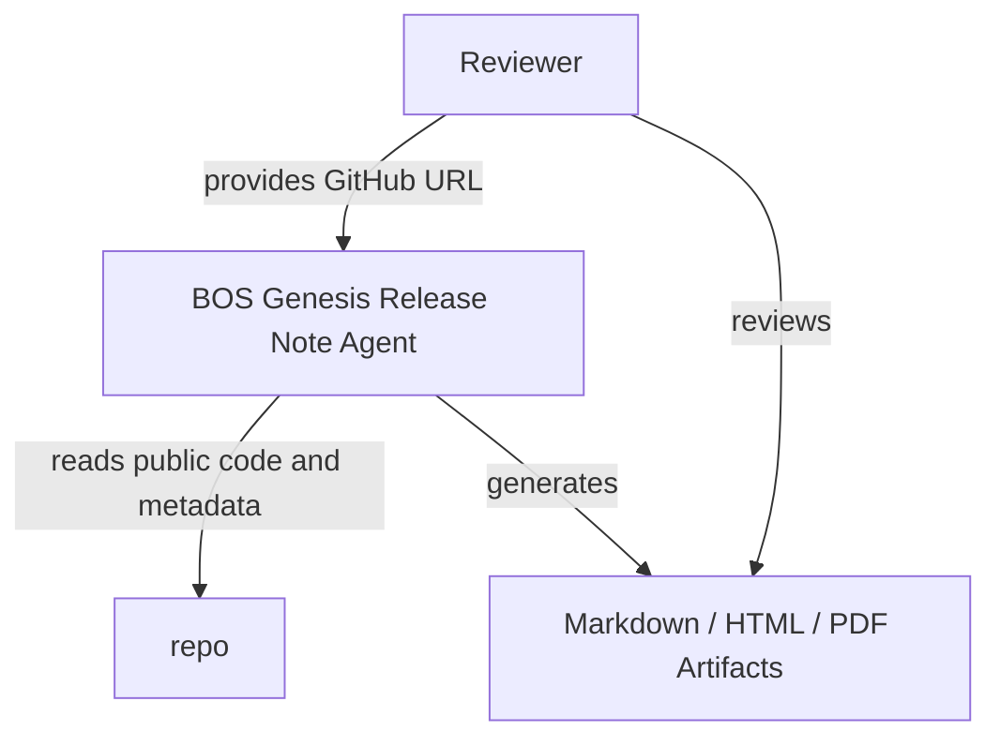
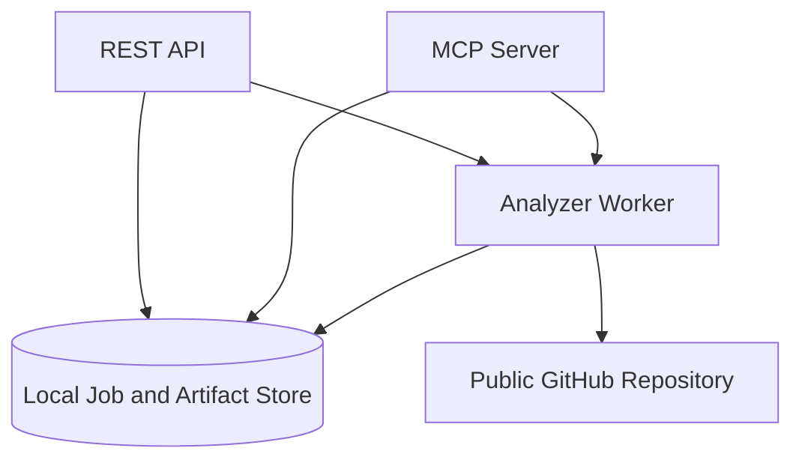
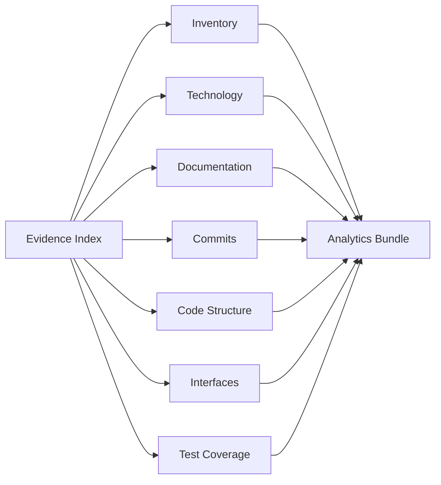
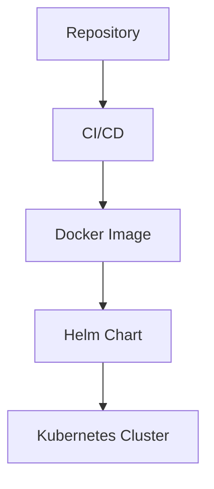

# Bosgenesis Mop Creation Agent Release Notes

## Document Control

- Release: v0.0.1
- Repository: https://github.com/aveeshek/bosgenesis-mop-creation-agent
- Generated At: 2026-08-12T19:51:32.049756+00:00
- Job ID: scan_e9a853127bb74983a899a836afbbca5c

## Executive Summary

`bosgenesis-mop-creation-agent` is a spec-first, LLM-assisted agent for reconstructing how a single BOS Genesis Kubernetes namespace was installed and generating reproducible installation documentation. Intent source: `stated`. Evidence: `ev_77c14aac2d368cd30e3d`.

## Release Overview

Analytics bundle generated for repository review. Missing evidence: Missing HLD documentation.; Missing LLD documentation.; No ADR documentation detected.; No coverage report evidence detected.; No module-level specs.md documentation detected.; No pytest or JUnit test report evidence detected.; Unsupported source extension for structure parsing: .sh

## Repository Overview

Section `inventory` is available with 200 evidence references.

## Project Intent

`bosgenesis-mop-creation-agent` is a spec-first, LLM-assisted agent for reconstructing how a single BOS Genesis Kubernetes namespace was installed and generating reproducible installation documentation. Intent source: `stated`. Evidence: `ev_77c14aac2d368cd30e3d`.

## Technology Inventory

| Technology | Category | Confidence | Evidence |
| --- | --- | ---: | --- |
| GitHub Actions | ci | 0.95 | `ev_b8513d34d9b95ab98637`, `ev_2e74cc4ca705b1d4b36d` |
| Docker | container | 0.95 | `ev_67ad3e78257ca02be394` |
| Helm | deployment | 0.95 | `ev_1d04999b553ab7a56325` |
| Kubernetes | deployment | 0.90 | `ev_47b514ff5edcc68d93ef`, `ev_401e0b136694e1625184`, `ev_e9c3c74df325df0b6f3c` |
| FastAPI | framework | 0.95 | `ev_f3fe3da5e759848201a6` |
| MCP | framework | 0.90 | `ev_f3fe3da5e759848201a6` |
| Pydantic | framework | 0.95 | `ev_f3fe3da5e759848201a6` |
| Python | language | 0.95 | `ev_5d89b9a84edb146a6c40`, `ev_6d6c64dbacb27870e0c1`, `ev_d050b98a38c3651eb17b` |
| Shell | language | 0.95 | `ev_1148c5080a899a4919c5`, `ev_f4686b71511f63a00f7b`, `ev_06080d69eed49b278bc0` |
| Ruff | linting | 0.95 | `ev_f3fe3da5e759848201a6` |
| Python packaging | packaging | 0.95 | `ev_f3fe3da5e759848201a6` |
| pytest | testing | 0.95 | `ev_f3fe3da5e759848201a6` |

## Architecture Overview

### Repository Analysis Flow

Repository evidence is collected before analytics and report rendering. Confidence: `0.95`.

### C4 Context

High-level context for repository scanning and release-note production. Confidence: `0.80`.

### C4 Container

Runtime containers and their main data flows. Confidence: `0.75`.

### Component Analysis

Analyzer components feeding the normalized analytics bundle. Confidence: `0.85`.

### Deployment Topology

Deployment topology derived only from detected deployment evidence. Confidence: `0.80`.

## Interface Inventory

Detected interfaces: 143.
Recommendations: No explicit CLI command contracts detected.; No explicit MCP tool contracts detected.

## Code Analytics

Section data is available with gaps. Missing evidence: Unsupported source extension for structure parsing: .sh

## Test Analytics

Test source files: 18. Parsed test reports: 0.

## Coverage Analytics

Coverage evidence is missing; no coverage percentage is reported.

## Commit Analytics

Commits analyzed: 21. Authors: 2. Changed files: 201.

## Quality and Risk Assessment

Risky areas: docs/01_SPEC_MOP_CREATION_AGENT.md, src/bosgenesis_mop_creation_agent/rendering/artifact_writer.py, src/bosgenesis_mop_creation_agent/core/orchestrator.py, docs/05_OUTPUT_CONTRACTS.md, docs/SPEC.md, charts/bosgenesis-mop-creation-agent/values.yaml, docs/04_ALGORITHM_MOP_CREATION_AGENT.md, src/bosgenesis_mop_creation_agent/api/routes.py, tests/test_phase1_contract.py, src/bosgenesis_mop_creation_agent/config/settings.py

## Known Gaps

- Missing HLD documentation.
- Missing LLD documentation.
- No ADR documentation detected.
- No coverage report evidence detected.
- No module-level specs.md documentation detected.
- No pytest or JUnit test report evidence detected.
- Unsupported source extension for structure parsing: .sh

## Evidence Traceability

| Evidence ID | Source | Summary |
| --- | --- | --- |
| `ev_01118e20eab4f0bc8720` | tests/fixtures/SPEC.md | test file tests/fixtures/SPEC.md (231 bytes) |
| `ev_0215fa6c313f3095bc0e` | src/bosgenesis_mop_creation_agent/observability/models.py | source file src/bosgenesis_mop_creation_agent/observability/models.py (1517 bytes) |
| `ev_0249e91dac294405038f` | charts/bosgenesis-mop-creation-agent/SPEC.md | deployment file charts/bosgenesis-mop-creation-agent/SPEC.md (363 bytes) |
| `ev_02b5b20ed23a3108c05e` | src/bosgenesis_mop_creation_agent/api/SPEC.md | docs file src/bosgenesis_mop_creation_agent/api/SPEC.md (5261 bytes) |
| `ev_04f7d197d717080e2ed2` | docs/K8S_INSPECTOR_RESOURCE_DETAIL_ENRICHMENT_PLAN.md | docs file docs/K8S_INSPECTOR_RESOURCE_DETAIL_ENRICHMENT_PLAN.md (8029 bytes) |
| `ev_05d874164f8ced6b81e0` | src/bosgenesis_mop_creation_agent/retrieval/models.py | source file src/bosgenesis_mop_creation_agent/retrieval/models.py (1771 bytes) |
| `ev_06080d69eed49b278bc0` | playbook/uninstaller.sh | source file playbook/uninstaller.sh (3091 bytes) |
| `ev_0695455bf63159073903` | playbook/operations/SPEC.md | docs file playbook/operations/SPEC.md (259 bytes) |
| `ev_08dbb6440ccd7683b217` | src/bosgenesis_mop_creation_agent/reasoning/SPEC.md | docs file src/bosgenesis_mop_creation_agent/reasoning/SPEC.md (2231 bytes) |
| `ev_097570598ae58d4da79f` | src/bosgenesis_mop_creation_agent/core/orchestrator.py | source file src/bosgenesis_mop_creation_agent/core/orchestrator.py (36273 bytes) |
| `ev_0a2bf858b71044d9b4f1` | src/bosgenesis_mop_creation_agent/reconstruction/SPEC.md | docs file src/bosgenesis_mop_creation_agent/reconstruction/SPEC.md (1637 bytes) |
| `ev_0b15b315a16f5f0cd2f7` | charts/bosgenesis-mop-creation-agent/values.credentials.example.yaml | deployment file charts/bosgenesis-mop-creation-agent/values.credentials.example.yaml (596 bytes) |
| `ev_0c772b34fd3362153680` | memory/langmem/SPEC.md | docs file memory/langmem/SPEC.md (275 bytes) |
| `ev_0f2b20e2cfb1a7376f6f` | src/bosgenesis_mop_creation_agent/sources/postgres_snapshot_reader.py | source file src/bosgenesis_mop_creation_agent/sources/postgres_snapshot_reader.py (7148 bytes) |
| `ev_1148c5080a899a4919c5` | playbook/deploy.sh | source file playbook/deploy.sh (8003 bytes) |
| `ev_11d0d4c6b8f68f375052` | src/bosgenesis_mop_creation_agent/persistence/SPEC.md | docs file src/bosgenesis_mop_creation_agent/persistence/SPEC.md (1919 bytes) |
| `ev_132ae72cdc6e4a860beb` | src/bosgenesis_mop_creation_agent/retrieval/qdrant_client.py | source file src/bosgenesis_mop_creation_agent/retrieval/qdrant_client.py (4764 bytes) |
| `ev_143e9f9de18dfda8371b` | src/bosgenesis_mop_creation_agent/llm/models.py | source file src/bosgenesis_mop_creation_agent/llm/models.py (3526 bytes) |
| `ev_1582e0a9c331893896a6` | src/bosgenesis_mop_creation_agent/retrieval/__init__.py | source file src/bosgenesis_mop_creation_agent/retrieval/__init__.py (258 bytes) |
| `ev_172bfcf340c09d4c26fb` | src/bosgenesis_mop_creation_agent/sources/snapshot_selector.py | source file src/bosgenesis_mop_creation_agent/sources/snapshot_selector.py (3372 bytes) |
| `ev_17fae9fa2895c58541a5` | src/bosgenesis_mop_creation_agent/common/__init__.py | source file src/bosgenesis_mop_creation_agent/common/__init__.py (25 bytes) |
| `ev_18eedfb78c251bc35efe` | src/bosgenesis_mop_creation_agent/mcp_clients/base.py | source file src/bosgenesis_mop_creation_agent/mcp_clients/base.py (8295 bytes) |
| `ev_1b0adf6dcca7a262769e` | src/bosgenesis_mop_creation_agent/retrieval/component_query_builder.py | source file src/bosgenesis_mop_creation_agent/retrieval/component_query_builder.py (5788 bytes) |
| `ev_1c6fa065335d601bf53b` | src/bosgenesis_mop_creation_agent/memory/SPEC.md | docs file src/bosgenesis_mop_creation_agent/memory/SPEC.md (3714 bytes) |
| `ev_1ca50c7fb20cd38e37e2` | src/bosgenesis_mop_creation_agent/memory/__init__.py | source file src/bosgenesis_mop_creation_agent/memory/__init__.py (267 bytes) |
| `ev_1d04999b553ab7a56325` | charts/bosgenesis-mop-creation-agent/Chart.yaml | deployment file charts/bosgenesis-mop-creation-agent/Chart.yaml (149 bytes) |
| `ev_1dae5891b36c58d17441` | src/bosgenesis_mop_creation_agent/classification/SPEC.md | docs file src/bosgenesis_mop_creation_agent/classification/SPEC.md (2676 bytes) |
| `ev_1db017b528e4dfb2de7a` | src/bosgenesis_mop_creation_agent/entrypoints/main.py | source file src/bosgenesis_mop_creation_agent/entrypoints/main.py (311 bytes) |
| `ev_1eab7c630a9a1737d2f9` | tests/test_phase11_memory_layer.py | test file tests/test_phase11_memory_layer.py (7555 bytes) |
| `ev_22061d541372115a8cbf` | PROJECT_STRUCTURE.md | docs file PROJECT_STRUCTURE.md (1340 bytes) |
| `ev_2429afca15c9e9586b17` | artifacts/SPEC.md | docs file artifacts/SPEC.md (449 bytes) |
| `ev_24a4e6a5c7c937abe691` | src/bosgenesis_mop_creation_agent/documents/SPEC.md | docs file src/bosgenesis_mop_creation_agent/documents/SPEC.md (2776 bytes) |
| `ev_2833156485dcc3fb4f88` | tests/e2e/SPEC.md | test file tests/e2e/SPEC.md (294 bytes) |
| `ev_2996a363a882780923f6` | src/bosgenesis_mop_creation_agent/rendering/SPEC.md | docs file src/bosgenesis_mop_creation_agent/rendering/SPEC.md (4875 bytes) |
| `ev_2a66fe37e73b5c99a8a0` | docs/DEPLOYMENT.md | docs file docs/DEPLOYMENT.md (3993 bytes) |
| `ev_2c7894d4b494d1058e80` | codex/skills/SPEC.md | docs file codex/skills/SPEC.md (221 bytes) |
| `ev_2ca82a81d06161df4a4f` | src/bosgenesis_mop_creation_agent/core/__init__.py | source file src/bosgenesis_mop_creation_agent/core/__init__.py (35 bytes) |
| `ev_2cda1ade681501743bc0` | playbook/rollback/SPEC.md | docs file playbook/rollback/SPEC.md (224 bytes) |
| `ev_2e74cc4ca705b1d4b36d` | .github/workflows/ci.yml | ci file .github/workflows/ci.yml (1079 bytes) |
| `ev_2f58f7014aee8f5d22f2` | src/bosgenesis_mop_creation_agent/mcp_clients/data_ingestion_client.py | source file src/bosgenesis_mop_creation_agent/mcp_clients/data_ingestion_client.py (1995 bytes) |
| `ev_30dbd1996cef303046b6` | src/bosgenesis_mop_creation_agent/config/__init__.py | source file src/bosgenesis_mop_creation_agent/config/__init__.py (38 bytes) |
| `ev_37e2f81e3b52a374cd14` | src/bosgenesis_mop_creation_agent/api/routes.py | source file src/bosgenesis_mop_creation_agent/api/routes.py (13892 bytes) |
| `ev_38d93fea68a7c005e3da` | src/bosgenesis_mop_creation_agent/entrypoints/SPEC.md | docs file src/bosgenesis_mop_creation_agent/entrypoints/SPEC.md (960 bytes) |
| `ev_39d0ca56036a5b64840e` | src/bosgenesis_mop_creation_agent/models/SPEC.md | docs file src/bosgenesis_mop_creation_agent/models/SPEC.md (2302 bytes) |
| `ev_3b92380b81605754d621` | artifacts/installation-notes/installation_notes_template.md | docs file artifacts/installation-notes/installation_notes_template.md (10092 bytes) |
| `ev_3c82bd1762065638e950` | samples/SPEC.md | docs file samples/SPEC.md (431 bytes) |
| `ev_401e0b136694e1625184` | charts/bosgenesis-mop-creation-agent/templates/ingress.yaml | deployment file charts/bosgenesis-mop-creation-agent/templates/ingress.yaml (991 bytes) |
| `ev_418ca48b79187aea39f9` | artifacts/human-mop/SPEC.md | docs file artifacts/human-mop/SPEC.md (2238 bytes) |
| `ev_418d6c6575b49e9e21fa` | src/bosgenesis_mop_creation_agent/api/app.py | source file src/bosgenesis_mop_creation_agent/api/app.py (1172 bytes) |
| `ev_43df8394db8690aa241a` | .gitignore | config file .gitignore (218 bytes) |
| `ev_44de9a4e550de1274416` | tests/test_snapshot_selector.py | test file tests/test_snapshot_selector.py (3163 bytes) |
| `ev_4622ba924cad79fdcf56` | evaluations/SPEC.md | docs file evaluations/SPEC.md (303 bytes) |
| `ev_4771559bab81167c57ab` | playbook/deployment/SPEC.md | docs file playbook/deployment/SPEC.md (303 bytes) |
| `ev_47b514ff5edcc68d93ef` | charts/bosgenesis-mop-creation-agent/templates/deployment.yaml | deployment file charts/bosgenesis-mop-creation-agent/templates/deployment.yaml (2581 bytes) |
| `ev_48615a8eab93fb62b806` | src/bosgenesis_mop_creation_agent/classification/__init__.py | source file src/bosgenesis_mop_creation_agent/classification/__init__.py (357 bytes) |
| `ev_4875eebb2b386b4ea83e` | src/bosgenesis_mop_creation_agent/reconstruction/helm_values.py | source file src/bosgenesis_mop_creation_agent/reconstruction/helm_values.py (2361 bytes) |
| `ev_490380b7e52afd530cd0` | knowledge-base/design/SPEC.md | docs file knowledge-base/design/SPEC.md (104 bytes) |
| `ev_4cb163cd63993f517641` | src/bosgenesis_mop_creation_agent/reconstruction/helm_hints.py | source file src/bosgenesis_mop_creation_agent/reconstruction/helm_hints.py (3064 bytes) |
| `ev_4d124872f00415d1d306` | .agents/skills/SPEC.md | docs file .agents/skills/SPEC.md (265 bytes) |
| `ev_5016e3cf5cffaf3e5918` | docs/SPEC.md | docs file docs/SPEC.md (3905 bytes) |
| `ev_50510afcd8a01b09d338` | docs/kubernetes-mop-sample.md | docs file docs/kubernetes-mop-sample.md (9285 bytes) |
| `ev_5081caa55a4fe427a88e` | src/bosgenesis_mop_creation_agent/llm/SPEC.md | docs file src/bosgenesis_mop_creation_agent/llm/SPEC.md (5822 bytes) |
| `ev_5194ac74912280518d08` | playbook/test-report.ps1 | other file playbook/test-report.ps1 (958 bytes) |
| `ev_528efde344130ba696ad` | src/bosgenesis_mop_creation_agent/retrieval/SPEC.md | docs file src/bosgenesis_mop_creation_agent/retrieval/SPEC.md (1991 bytes) |
| `ev_5818a72b05c62593265b` | docs/06_APPLICATION_MODE.md | docs file docs/06_APPLICATION_MODE.md (7498 bytes) |
| `ev_5a1389eb4f6c94d3cec8` | docs/CONTEXT_SNAPSHOT.md | docs file docs/CONTEXT_SNAPSHOT.md (7259 bytes) |
| `ev_5a655a71453b298dc22e` | memory/SPEC.md | docs file memory/SPEC.md (631 bytes) |
| `ev_5a95997b5e3895f8c95e` | src/bosgenesis_mop_creation_agent/common/SPEC.md | docs file src/bosgenesis_mop_creation_agent/common/SPEC.md (714 bytes) |
| `ev_5be03f712bf6a75abe2a` | src/bosgenesis_mop_creation_agent/memory/service.py | source file src/bosgenesis_mop_creation_agent/memory/service.py (8584 bytes) |
| `ev_5d89b9a84edb146a6c40` | src/bosgenesis_mop_creation_agent/__init__.py | source file src/bosgenesis_mop_creation_agent/__init__.py (62 bytes) |
| `ev_5e429446e99412ad7873` | tests/contracts/SPEC.md | test file tests/contracts/SPEC.md (273 bytes) |
| `ev_5ebb6117f46f025f1cd2` | src/bosgenesis_mop_creation_agent/mcp_clients/k8s_inspector_client.py | source file src/bosgenesis_mop_creation_agent/mcp_clients/k8s_inspector_client.py (7628 bytes) |
| `ev_5f86f1e8af21e1c135b9` | knowledge-base/interfaces/SPEC.md | docs file knowledge-base/interfaces/SPEC.md (252 bytes) |
| `ev_615dd8aa37eb9f615f5e` | codex/SPEC.md | docs file codex/SPEC.md (474 bytes) |
| `ev_6217b5407b2bef6f388a` | tests/SPEC.md | test file tests/SPEC.md (1442 bytes) |
| `ev_62efa8daf9ca8d43c7d3` | charts/bosgenesis-mop-creation-agent/templates/SPEC.md | deployment file charts/bosgenesis-mop-creation-agent/templates/SPEC.md (218 bytes) |
| `ev_630b8f5d9948b5b99174` | src/bosgenesis_mop_creation_agent/sources/clickhouse_snapshot_reader.py | source file src/bosgenesis_mop_creation_agent/sources/clickhouse_snapshot_reader.py (6669 bytes) |
| `ev_642a44a2cde9530c382c` | knowledge-base/schemas/SPEC.md | docs file knowledge-base/schemas/SPEC.md (196 bytes) |
| `ev_64b0478c45d72c281264` | .agents/skills/SKILLS.md | docs file .agents/skills/SKILLS.md (9902 bytes) |
| `ev_67479049fcdb98f4ac71` | docs/03_LLD_MOP_CREATION_AGENT.md | docs file docs/03_LLD_MOP_CREATION_AGENT.md (23592 bytes) |
| `ev_67ad3e78257ca02be394` | Dockerfile | deployment file Dockerfile (553 bytes) |
| `ev_67cd7ad58e7147e7976b` | SPEC.md | docs file SPEC.md (1808 bytes) |
| `ev_68f3f5c70d08cccf79ca` | src/bosgenesis_mop_creation_agent/llm/model_gateway.py | source file src/bosgenesis_mop_creation_agent/llm/model_gateway.py (3217 bytes) |
| `ev_6a49280da88cd3ab7ae3` | docs/SAMPLE_REQUESTS.md | docs file docs/SAMPLE_REQUESTS.md (5143 bytes) |
| `ev_6bd8cfc46345312f3fea` | src/bosgenesis_mop_creation_agent/SPEC.md | docs file src/bosgenesis_mop_creation_agent/SPEC.md (2009 bytes) |
| `ev_6bf32e7ff54ce5f7ee1f` | deploy/k8s/overlays/SPEC.md | deployment file deploy/k8s/overlays/SPEC.md (185 bytes) |
| `ev_6d038bdd77f781ab1d19` | tests/test_phase62_llm_repair.py | test file tests/test_phase62_llm_repair.py (9549 bytes) |
| `ev_6d6c64dbacb27870e0c1` | src/bosgenesis_mop_creation_agent/__main__.py | source file src/bosgenesis_mop_creation_agent/__main__.py (105 bytes) |
| `ev_6d919211ed47d1ab370f` | samples/requests/SPEC.md | docs file samples/requests/SPEC.md (355 bytes) |
| `ev_6e21fb6eef712b685656` | artifacts/installation-notes/SPEC.md | docs file artifacts/installation-notes/SPEC.md (1174 bytes) |
| `ev_6f1fb66f9e1813caf484` | src/bosgenesis_mop_creation_agent/rendering/pdf_renderer.py | source file src/bosgenesis_mop_creation_agent/rendering/pdf_renderer.py (39550 bytes) |
| `ev_6fae49a8869ae2448170` | samples/requests/application-mode-smoke-generate.json | config file samples/requests/application-mode-smoke-generate.json (388 bytes) |
| `ev_70722b242a66f71cff62` | src/bosgenesis_mop_creation_agent/reconstruction/models.py | source file src/bosgenesis_mop_creation_agent/reconstruction/models.py (1494 bytes) |
| `ev_72d2020c68fcce239a3a` | AGENTS.md | docs file AGENTS.md (1880 bytes) |
| `ev_73c142ce98f76b1a9769` | deploy/SPEC.md | deployment file deploy/SPEC.md (199 bytes) |
| `ev_74b6bab69c1de1e41eb0` | src/bosgenesis_mop_creation_agent/llm/__init__.py | source file src/bosgenesis_mop_creation_agent/llm/__init__.py (243 bytes) |
| `ev_75f30a2ebccc6225edce` | tests/test_health.py | test file tests/test_health.py (1746 bytes) |
| `ev_761443aae444673e6777` | src/bosgenesis_mop_creation_agent/retrieval/reference_lookup.py | source file src/bosgenesis_mop_creation_agent/retrieval/reference_lookup.py (12202 bytes) |
| `ev_77a7b06d27a01a5785ef` | tests/test_artifact_writer_inventory.py | test file tests/test_artifact_writer_inventory.py (29274 bytes) |
| `ev_77ada1c1236970706128` | charts/bosgenesis-mop-creation-agent/.helmignore | deployment file charts/bosgenesis-mop-creation-agent/.helmignore (65 bytes) |
| `ev_77c14aac2d368cd30e3d` | README.md | docs file README.md (4415 bytes) |
| `ev_77f71bf88050d2415537` | artifacts/human-mop/human_mop_pdf_template.md | docs file artifacts/human-mop/human_mop_pdf_template.md (11469 bytes) |
| `ev_7acb9fd66f09134783a2` | config/SPEC.md | docs file config/SPEC.md (572 bytes) |
| `ev_7bc8d242369c0305dc5a` | codex/config/SPEC.md | docs file codex/config/SPEC.md (186 bytes) |
| `ev_7bca3cac3d1595b99d5c` | docs/07_SAMPLE_MOP_TEMPLATE.md | docs file docs/07_SAMPLE_MOP_TEMPLATE.md (3754 bytes) |
| `ev_7d40d7503a24176d65e1` | playbook/SPEC.md | docs file playbook/SPEC.md (220 bytes) |
| `ev_7f4d2a3ddaecd94b2aa9` | src/bosgenesis_mop_creation_agent/reconstruction/manifest_normalizer.py | source file src/bosgenesis_mop_creation_agent/reconstruction/manifest_normalizer.py (8191 bytes) |
| `ev_7fb596b29c3b0514ba9a` | knowledge-base/SPEC.md | docs file knowledge-base/SPEC.md (262 bytes) |
| `ev_80845fce5111ce5e4117` | tests/test_phase4_mcp_enrichment.py | test file tests/test_phase4_mcp_enrichment.py (10444 bytes) |
| `ev_80b594f1eeac5e9e731f` | src/bosgenesis_mop_creation_agent/config/settings.py | source file src/bosgenesis_mop_creation_agent/config/settings.py (15051 bytes) |
| `ev_80be0eb49d4ce239861d` | knowledge-base/session/SPEC.md | docs file knowledge-base/session/SPEC.md (199 bytes) |
| `ev_82b86dd7bcfeaf458384` | evaluations/grounding/SPEC.md | docs file evaluations/grounding/SPEC.md (161 bytes) |
| `ev_841551ced5d7411a553b` | artifacts/human-mop/professional_mop_pdf_template.yaml | config file artifacts/human-mop/professional_mop_pdf_template.yaml (1794 bytes) |
| `ev_871b5f123fb8c8f20d27` | memory/clickhouse/SPEC.md | docs file memory/clickhouse/SPEC.md (318 bytes) |
| `ev_8762f0ea2f342c45bc63` | .dockerignore | config file .dockerignore (103 bytes) |
| `ev_8b252db36f94a9f82ca6` | charts/bosgenesis-mop-creation-agent/templates/configmap.yaml | deployment file charts/bosgenesis-mop-creation-agent/templates/configmap.yaml (779 bytes) |
| `ev_8b65515df99887a64402` | certs/.gitkeep | other file certs/.gitkeep (1 bytes) |
| `ev_8b69f8cdeab7ae0e7747` | LICENSE | other file LICENSE (2417 bytes) |
| `ev_8c7ffc3860875f47cea9` | codex/prompts/SPEC.md | docs file codex/prompts/SPEC.md (313 bytes) |
| `ev_8caf21e684f3c4f49706` | .github/SPEC.md | docs file .github/SPEC.md (272 bytes) |
| `ev_8d4ac890822f20c7f611` | src/bosgenesis_mop_creation_agent/models/__init__.py | source file src/bosgenesis_mop_creation_agent/models/__init__.py (37 bytes) |
| `ev_923c00a0c11c7f1cc147` | charts/bosgenesis-mop-creation-agent/templates/secret.yaml | deployment file charts/bosgenesis-mop-creation-agent/templates/secret.yaml (560 bytes) |
| `ev_9335f2926048d2f73603` | docs/02_HLD_MOP_CREATION_AGENT.md | docs file docs/02_HLD_MOP_CREATION_AGENT.md (14244 bytes) |
| `ev_93407a87c67224ea658e` | src/bosgenesis_mop_creation_agent/llm/repair_suggester.py | source file src/bosgenesis_mop_creation_agent/llm/repair_suggester.py (11083 bytes) |
| `ev_94b0633a0ed3e5f94bfd` | tests/test_phase13_observability.py | test file tests/test_phase13_observability.py (6492 bytes) |
| `ev_95171e4888c964267997` | src/bosgenesis_mop_creation_agent/models/responses.py | source file src/bosgenesis_mop_creation_agent/models/responses.py (2024 bytes) |
| `ev_95815d20869391588781` | tests/test_phase6_reconstruction.py | test file tests/test_phase6_reconstruction.py (14039 bytes) |
| `ev_9675925aa23196696794` | memory/redis/SPEC.md | docs file memory/redis/SPEC.md (390 bytes) |
| `ev_98b864d4c66e6b09e8de` | skills/mop-creation/SPEC.md | docs file skills/mop-creation/SPEC.md (292 bytes) |
| `ev_9cd7542c812a820a0258` | src/bosgenesis_mop_creation_agent/classification/resource_classifier.py | source file src/bosgenesis_mop_creation_agent/classification/resource_classifier.py (9076 bytes) |
| `ev_9d5c6f7779115d67c7d9` | docs/04_ALGORITHM_MOP_CREATION_AGENT.md | docs file docs/04_ALGORITHM_MOP_CREATION_AGENT.md (28900 bytes) |
| `ev_9e6633d3717f15547820` | reports/.gitkeep | other file reports/.gitkeep (1 bytes) |
| `ev_9ffbf4ead9766395774d` | skills/SPEC.md | docs file skills/SPEC.md (243 bytes) |
| `ev_a1bd050cd2afa224a7cf` | samples/requests/platform-only-generate.json | config file samples/requests/platform-only-generate.json (379 bytes) |
| `ev_a2e3c18582c6e7c9d77c` | src/bosgenesis_mop_creation_agent/api/mcp.py | source file src/bosgenesis_mop_creation_agent/api/mcp.py (7200 bytes) |
| `ev_a73258a057bcc30dce10` | evaluations/safety/SPEC.md | docs file evaluations/safety/SPEC.md (161 bytes) |
| `ev_a75afa9fc4a33974f10b` | src/bosgenesis_mop_creation_agent/rendering/artifact_writer.py | source file src/bosgenesis_mop_creation_agent/rendering/artifact_writer.py (88609 bytes) |
| `ev_a8c000a5f3dfaac40a7e` | src/bosgenesis_mop_creation_agent/observability/SPEC.md | docs file src/bosgenesis_mop_creation_agent/observability/SPEC.md (2536 bytes) |
| `ev_a973711b12e8be97e090` | .agents/skills/SKILL.md | docs file .agents/skills/SKILL.md (8207 bytes) |
| `ev_a9af905b811d2917df56` | src/bosgenesis_mop_creation_agent/memory/adapters.py | source file src/bosgenesis_mop_creation_agent/memory/adapters.py (12648 bytes) |
| `ev_ada2596a98142cf139dc` | src/bosgenesis_mop_creation_agent/observability/service.py | source file src/bosgenesis_mop_creation_agent/observability/service.py (17472 bytes) |
| `ev_af8a42fedc3cf4774cb8` | src/bosgenesis_mop_creation_agent/observability/__init__.py | source file src/bosgenesis_mop_creation_agent/observability/__init__.py (213 bytes) |
| `ev_b01c473f0e677ee7a5d5` | config/settings.yaml | config file config/settings.yaml (2375 bytes) |
| `ev_b05c864663904ab889ac` | TECH_STACK.md | docs file TECH_STACK.md (1192 bytes) |
| `ev_b2888d30e9d1eaee09f8` | tests/test_phase9_qdrant_references.py | test file tests/test_phase9_qdrant_references.py (9989 bytes) |
| `ev_b68ec4a56e79749fcc34` | codex/skills/SKILL.md | docs file codex/skills/SKILL.md (2712 bytes) |
| `ev_b6c1682075f0f5680a4e` | src/bosgenesis_mop_creation_agent/models/requests.py | source file src/bosgenesis_mop_creation_agent/models/requests.py (2539 bytes) |
| `ev_b715c8723998e2082501` | charts/bosgenesis-mop-creation-agent/templates/_helpers.tpl | deployment file charts/bosgenesis-mop-creation-agent/templates/_helpers.tpl (1481 bytes) |
| `ev_b8513d34d9b95ab98637` | .github/workflows/SPEC.md | ci file .github/workflows/SPEC.md (574 bytes) |
| `ev_ba46f86871725f12e5c4` | reports/SPEC.md | docs file reports/SPEC.md (901 bytes) |
| `ev_c00641e969917c77831b` | src/bosgenesis_mop_creation_agent/collectors/SPEC.md | docs file src/bosgenesis_mop_creation_agent/collectors/SPEC.md (1181 bytes) |
| `ev_c743d62eda0886a14f3b` | docs/05_OUTPUT_CONTRACTS.md | docs file docs/05_OUTPUT_CONTRACTS.md (18495 bytes) |
| `ev_c76be62b04e9e08064aa` | docs/RELEASE_CANDIDATE_RUNBOOK.md | docs file docs/RELEASE_CANDIDATE_RUNBOOK.md (7686 bytes) |
| `ev_c876173f9f4250fd150a` | src/bosgenesis_mop_creation_agent/sources/SPEC.md | docs file src/bosgenesis_mop_creation_agent/sources/SPEC.md (1073 bytes) |
| `ev_c9ae493335a3c0044d39` | deploy/k8s/SPEC.md | deployment file deploy/k8s/SPEC.md (219 bytes) |
| `ev_cad346541c768e8f18d3` | src/bosgenesis_mop_creation_agent/reconstruction/command_builder.py | source file src/bosgenesis_mop_creation_agent/reconstruction/command_builder.py (2783 bytes) |
| `ev_cdab1d7083ef714c9634` | src/bosgenesis_mop_creation_agent/sources/snapshot_models.py | source file src/bosgenesis_mop_creation_agent/sources/snapshot_models.py (1811 bytes) |
| `ev_ce28964d034b488cbac5` | playbook/validation/SPEC.md | docs file playbook/validation/SPEC.md (300 bytes) |
| `ev_cf0853efe31871336051` | src/bosgenesis_mop_creation_agent/reconstruction/planner.py | source file src/bosgenesis_mop_creation_agent/reconstruction/planner.py (11834 bytes) |
| `ev_cfe2e1583e86a5c5cffb` | src/bosgenesis_mop_creation_agent/common/logging.py | source file src/bosgenesis_mop_creation_agent/common/logging.py (1803 bytes) |
| `ev_d050b98a38c3651eb17b` | src/bosgenesis_mop_creation_agent/api/__init__.py | source file src/bosgenesis_mop_creation_agent/api/__init__.py (25 bytes) |
| `ev_d05390013b2e2b4285fc` | tests/test_phase1_contract.py | test file tests/test_phase1_contract.py (15627 bytes) |
| `ev_d0e234662d43268194c8` | src/bosgenesis_mop_creation_agent/memory/models.py | source file src/bosgenesis_mop_creation_agent/memory/models.py (1367 bytes) |
| `ev_d3223e02e6f0c8dad858` | charts/SPEC.md | deployment file charts/SPEC.md (228 bytes) |
| `ev_d383bef7bd60b28b17ea` | src/bosgenesis_mop_creation_agent/evidence/SPEC.md | docs file src/bosgenesis_mop_creation_agent/evidence/SPEC.md (1421 bytes) |
| `ev_d3b18866aa6bc7eac0cb` | src/bosgenesis_mop_creation_agent/security/SPEC.md | docs file src/bosgenesis_mop_creation_agent/security/SPEC.md (1567 bytes) |
| `ev_d5fb452ba4241cfac238` | certs/SPEC.md | docs file certs/SPEC.md (1369 bytes) |
| `ev_d694304b72aa837a9797` | src/bosgenesis_mop_creation_agent/core/SPEC.md | docs file src/bosgenesis_mop_creation_agent/core/SPEC.md (4204 bytes) |
| `ev_d9592264d7b970a1a914` | charts/bosgenesis-mop-creation-agent/values.yaml | deployment file charts/bosgenesis-mop-creation-agent/values.yaml (5875 bytes) |
| `ev_daa30eebf0bb3dfaa572` | src/SPEC.md | docs file src/SPEC.md (2511 bytes) |
| `ev_dbd8ed295c1004a4737c` | src/bosgenesis_mop_creation_agent/langgraph/SPEC.md | docs file src/bosgenesis_mop_creation_agent/langgraph/SPEC.md (1505 bytes) |
| `ev_de3f418f6c823d06fb75` | deploy/k8s/base/SPEC.md | deployment file deploy/k8s/base/SPEC.md (196 bytes) |
| `ev_e1d968cf6eec5fc52851` | knowledge-base/decisions/SPEC.md | docs file knowledge-base/decisions/SPEC.md (192 bytes) |
| `ev_e4e5f13cd620408787e2` | src/bosgenesis_mop_creation_agent/classification/models.py | source file src/bosgenesis_mop_creation_agent/classification/models.py (1779 bytes) |
| `ev_e5ba743c1a24827662ad` | src/bosgenesis_mop_creation_agent/entrypoints/__init__.py | source file src/bosgenesis_mop_creation_agent/entrypoints/__init__.py (28 bytes) |
| `ev_e649840c1203eb43ab2b` | charts/bosgenesis-mop-creation-agent/values/SPEC.md | deployment file charts/bosgenesis-mop-creation-agent/values/SPEC.md (310 bytes) |
| `ev_e6999749f9dee0df2a84` | tests/test_phase7_pdf_renderer.py | test file tests/test_phase7_pdf_renderer.py (8692 bytes) |
| `ev_e7e6131415c9c4a71766` | src/bosgenesis_mop_creation_agent/mcp_clients/enrichment.py | source file src/bosgenesis_mop_creation_agent/mcp_clients/enrichment.py (9463 bytes) |
| `ev_e83ed2ea26f6c98e46c8` | tests/test_phase5_classification.py | test file tests/test_phase5_classification.py (6655 bytes) |
| `ev_e9b851f90cc1915837fd` | memory/mongodb/SPEC.md | docs file memory/mongodb/SPEC.md (277 bytes) |
| `ev_e9c3c74df325df0b6f3c` | charts/bosgenesis-mop-creation-agent/templates/service.yaml | deployment file charts/bosgenesis-mop-creation-agent/templates/service.yaml (428 bytes) |
| `ev_e9f8e943d6e8bcb67304` | src/bosgenesis_mop_creation_agent/application/SPEC.md | docs file src/bosgenesis_mop_creation_agent/application/SPEC.md (1429 bytes) |
| `ev_ead6398fa6e8b1c706ae` | docs/01_SPEC_MOP_CREATION_AGENT.md | docs file docs/01_SPEC_MOP_CREATION_AGENT.md (25454 bytes) |
| `ev_f1c0badc9aed43ce2c8a` | codex/config/config.toml | config file codex/config/config.toml (937 bytes) |
| `ev_f228b1e45d03ea9b32cb` | src/bosgenesis_mop_creation_agent/validation/SPEC.md | docs file src/bosgenesis_mop_creation_agent/validation/SPEC.md (1964 bytes) |
| `ev_f37ebe3ba4deabd4fe3c` | tests/test_phase15_release_candidate.py | test file tests/test_phase15_release_candidate.py (2251 bytes) |
| `ev_f3fe3da5e759848201a6` | pyproject.toml | config file pyproject.toml (1409 bytes) |
| `ev_f4686b71511f63a00f7b` | playbook/test-report.sh | source file playbook/test-report.sh (761 bytes) |
| `ev_f568d5c846f2e0bceb8e` | tests/test_phase10_bounded_reasoning.py | test file tests/test_phase10_bounded_reasoning.py (9367 bytes) |
| `ev_f5b611838cbb0bfa27dc` | docs/CREDENTIALS.md | docs file docs/CREDENTIALS.md (13166 bytes) |
| `ev_f62144b57f95f2fd9ee1` | src/bosgenesis_mop_creation_agent/reconstruction/__init__.py | source file src/bosgenesis_mop_creation_agent/reconstruction/__init__.py (132 bytes) |
| `ev_f6f219cb179c05b0692f` | src/bosgenesis_mop_creation_agent/llm/bounded_reasoning.py | source file src/bosgenesis_mop_creation_agent/llm/bounded_reasoning.py (15011 bytes) |
| `ev_f9e68a8418255c1f4033` | src/bosgenesis_mop_creation_agent/mcp_clients/helm_manager_client.py | source file src/bosgenesis_mop_creation_agent/mcp_clients/helm_manager_client.py (4107 bytes) |
| `ev_fa1603ff30c1ecdc1e93` | src/bosgenesis_mop_creation_agent/reconstruction/quality_gate.py | source file src/bosgenesis_mop_creation_agent/reconstruction/quality_gate.py (2454 bytes) |
| `ev_fa5263faa5170961ef94` | certs/README.md | docs file certs/README.md (740 bytes) |
| `ev_fa6a99a541553f8930c5` | charts/bosgenesis-mop-creation-agent/templates/pvc.yaml | deployment file charts/bosgenesis-mop-creation-agent/templates/pvc.yaml (680 bytes) |
| `ev_fbc042ea28fb3288e30b` | src/bosgenesis_mop_creation_agent/langchain/SPEC.md | docs file src/bosgenesis_mop_creation_agent/langchain/SPEC.md (1133 bytes) |
| `ev_fc0972fd59a82c0a2bf4` | src/bosgenesis_mop_creation_agent/mcp_clients/SPEC.md | docs file src/bosgenesis_mop_creation_agent/mcp_clients/SPEC.md (1594 bytes) |
| `ev_fc8e94f6796ba0df803d` | src/bosgenesis_mop_creation_agent/config/SPEC.md | docs file src/bosgenesis_mop_creation_agent/config/SPEC.md (4578 bytes) |
| `ev_fcfaca492fec4448433e` | memory/postgresql/SPEC.md | docs file memory/postgresql/SPEC.md (477 bytes) |

## Appendix

Generated by BOS Genesis Release Note Agent.

## Summary
Release-note-agent document preserved as the primary draft.

## Source Evidence
- GitHub URL: https://github.com/aveeshek/bosgenesis-mop-creation-agent
- release-note-agent status: `success`

## Repository Scan
- Repository: https://github.com/aveeshek/bosgenesis-mop-creation-agent
- Source ref: tag phase16.2-final-clone-reconstruction
- Clone status: `success`
- Primary language: `python`
- Files inspected: 91 code file(s), 2 manifest(s)
- Local checkout cleanup: `removed`

### Vulnerability Matrix
| Category | Severity | Findings | Evidence | Recommendation |
| --- | --- | ---: | --- | --- |
| Cryptography | medium | 2 | src/bosgenesis_mop_creation_agent/reconstruction/planner.py:195 (weak_hash) | Use SHA-256 or stronger algorithms unless this is non-security hashing. |

### Code Quality Matrix
| Area | Tool | Result | Findings | Notes |
| --- | --- | --- | ---: | --- |
| Language mix | repository inventory | python | 91 | Detected 2 dependency/build manifest(s). |
| Code quality | ruff | completed | 0 | pylint was unavailable; ruff was used as fallback. |
| Quality categories | ruff | summarized | 0 | lint: 0 |

### LLM Security Review Summary
- Overall risk: `medium`
- Summary: Static scan identified 2 common vulnerability signal(s) for human review.
- Safe reasoning summary: Reviewed static vulnerability findings, dependency manifests, and quality scan status for common risk themes.
