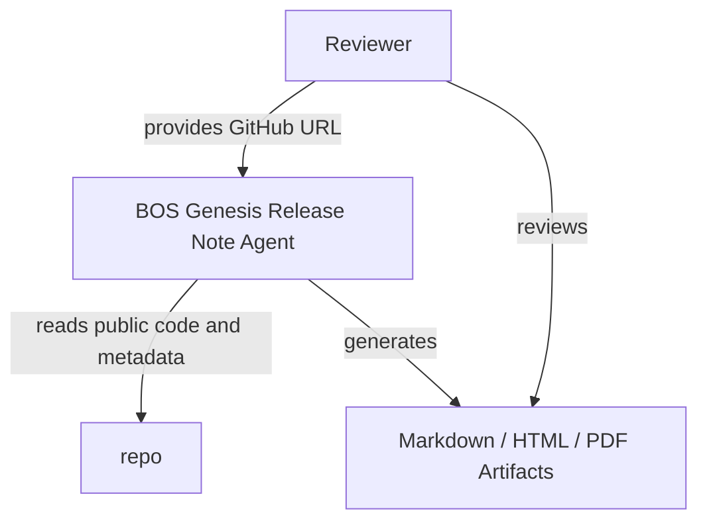
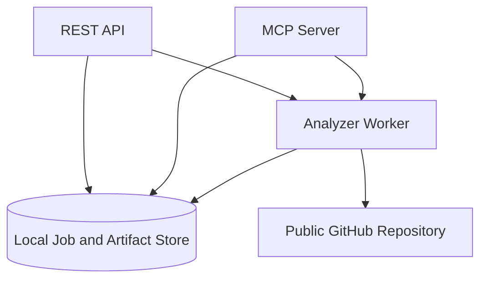
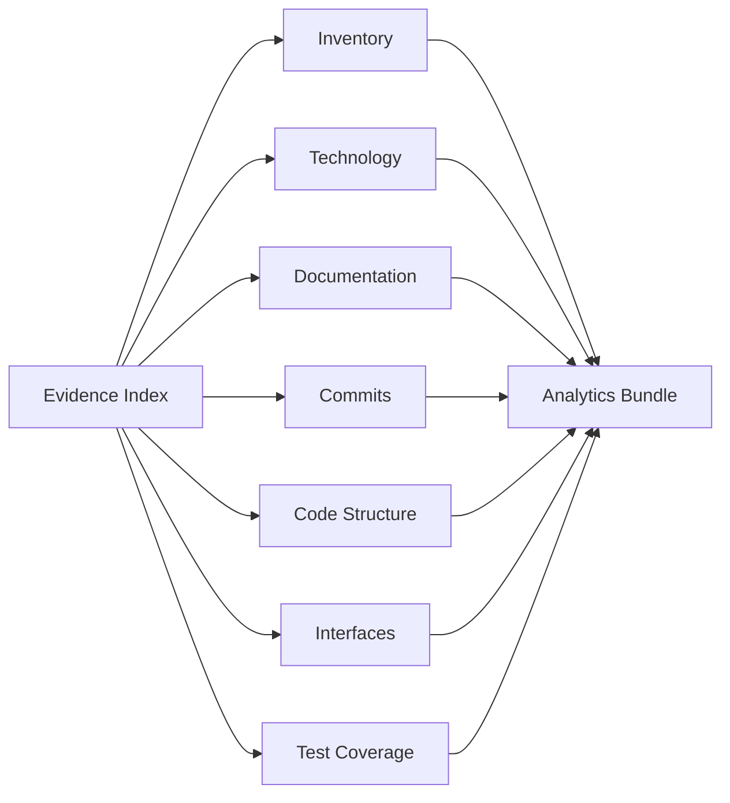
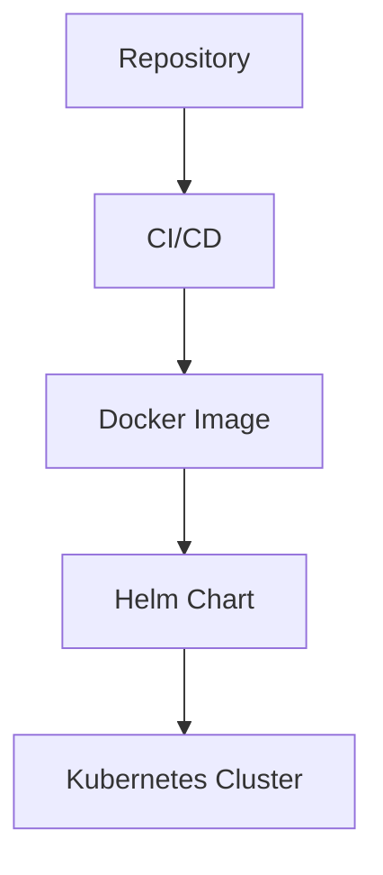

# Bosgenesis Mop Creation Agent Release Notes

## Document Control

- Release: v0.0.1
- Repository: https://github.com/aveeshek/bosgenesis-mop-creation-agent
- Generated At: 2026-08-18T01:29:46.793792+00:00
- Job ID: scan_2c45e0c6a15a4735a41411e428351093

## Executive Summary

`bosgenesis-mop-creation-agent` is a spec-first, LLM-assisted agent for reconstructing how a single BOS Genesis Kubernetes namespace was installed and generating reproducible installation documentation. Intent source: `stated`. Evidence: `ev_5491d91149ef0ab685a4`.

## Release Overview

Analytics bundle generated for repository review. Missing evidence: Missing HLD documentation.; Missing LLD documentation.; No ADR documentation detected.; No coverage report evidence detected.; No module-level specs.md documentation detected.; No pytest or JUnit test report evidence detected.; Unsupported source extension for structure parsing: .sh

## Repository Overview

Section `inventory` is available with 200 evidence references.

## Project Intent

`bosgenesis-mop-creation-agent` is a spec-first, LLM-assisted agent for reconstructing how a single BOS Genesis Kubernetes namespace was installed and generating reproducible installation documentation. Intent source: `stated`. Evidence: `ev_5491d91149ef0ab685a4`.

## Technology Inventory

| Technology | Category | Confidence | Evidence |
| --- | --- | ---: | --- |
| GitHub Actions | ci | 0.95 | `ev_9eafb5010d70233832d7`, `ev_98d54be382d764284c61` |
| Docker | container | 0.95 | `ev_22dfc9bfd708d9da3d0b` |
| Helm | deployment | 0.95 | `ev_95f6d6efaf96616b1968` |
| Kubernetes | deployment | 0.90 | `ev_f7449c5eea615c6965b5`, `ev_795812f011df59ea877c`, `ev_a4d5bf2e7a1b69344098` |
| FastAPI | framework | 0.95 | `ev_7cd3ab0c9105fb5cf811` |
| MCP | framework | 0.90 | `ev_7cd3ab0c9105fb5cf811` |
| Pydantic | framework | 0.95 | `ev_7cd3ab0c9105fb5cf811` |
| Python | language | 0.95 | `ev_e145ac79c148b3fe08f4`, `ev_e1fa36baeb5895b23ec6`, `ev_6ff80b7e8408dcfed467` |
| Shell | language | 0.95 | `ev_d8835160d9d2b36ce53b`, `ev_34f1f4a9754c5bdc7a16`, `ev_5c1648170f3ab72ea674` |
| Ruff | linting | 0.95 | `ev_7cd3ab0c9105fb5cf811` |
| Python packaging | packaging | 0.95 | `ev_7cd3ab0c9105fb5cf811` |
| pytest | testing | 0.95 | `ev_7cd3ab0c9105fb5cf811` |

## Architecture Overview

### Repository Analysis Flow

Repository evidence is collected before analytics and report rendering. Confidence: `0.95`.

### C4 Context

High-level context for repository scanning and release-note production. Confidence: `0.80`.

### C4 Container

Runtime containers and their main data flows. Confidence: `0.75`.

### Component Analysis

Analyzer components feeding the normalized analytics bundle. Confidence: `0.85`.

### Deployment Topology

Deployment topology derived only from detected deployment evidence. Confidence: `0.80`.

## Interface Inventory

Detected interfaces: 143.
Recommendations: No explicit CLI command contracts detected.; No explicit MCP tool contracts detected.

## Code Analytics

Section data is available with gaps. Missing evidence: Unsupported source extension for structure parsing: .sh

## Test Analytics

Test source files: 18. Parsed test reports: 0.

## Coverage Analytics

Coverage evidence is missing; no coverage percentage is reported.

## Commit Analytics

Commits analyzed: 21. Authors: 2. Changed files: 201.

## Quality and Risk Assessment

Risky areas: docs/01_SPEC_MOP_CREATION_AGENT.md, src/bosgenesis_mop_creation_agent/rendering/artifact_writer.py, src/bosgenesis_mop_creation_agent/core/orchestrator.py, docs/05_OUTPUT_CONTRACTS.md, docs/SPEC.md, charts/bosgenesis-mop-creation-agent/values.yaml, docs/04_ALGORITHM_MOP_CREATION_AGENT.md, src/bosgenesis_mop_creation_agent/api/routes.py, tests/test_phase1_contract.py, src/bosgenesis_mop_creation_agent/config/settings.py

## Known Gaps

- Missing HLD documentation.
- Missing LLD documentation.
- No ADR documentation detected.
- No coverage report evidence detected.
- No module-level specs.md documentation detected.
- No pytest or JUnit test report evidence detected.
- Unsupported source extension for structure parsing: .sh

## Evidence Traceability

| Evidence ID | Source | Summary |
| --- | --- | --- |
| `ev_0009e0e73e8c04ab5f0f` | samples/requests/application-mode-smoke-generate.json | config file samples/requests/application-mode-smoke-generate.json (388 bytes) |
| `ev_0408a18905666d25d1e9` | src/bosgenesis_mop_creation_agent/config/__init__.py | source file src/bosgenesis_mop_creation_agent/config/__init__.py (38 bytes) |
| `ev_04ef3e6eb7501041247e` | src/bosgenesis_mop_creation_agent/langchain/SPEC.md | docs file src/bosgenesis_mop_creation_agent/langchain/SPEC.md (1133 bytes) |
| `ev_05feade5060fba75b803` | src/bosgenesis_mop_creation_agent/mcp_clients/SPEC.md | docs file src/bosgenesis_mop_creation_agent/mcp_clients/SPEC.md (1594 bytes) |
| `ev_06257be0630d3d5102a1` | src/bosgenesis_mop_creation_agent/retrieval/models.py | source file src/bosgenesis_mop_creation_agent/retrieval/models.py (1771 bytes) |
| `ev_06eb67c7a2330524108c` | src/bosgenesis_mop_creation_agent/memory/service.py | source file src/bosgenesis_mop_creation_agent/memory/service.py (8584 bytes) |
| `ev_09460212b5136987ef76` | docs/05_OUTPUT_CONTRACTS.md | docs file docs/05_OUTPUT_CONTRACTS.md (18495 bytes) |
| `ev_09e2274c52e0b17405a8` | tests/fixtures/SPEC.md | test file tests/fixtures/SPEC.md (231 bytes) |
| `ev_0cd5b437f4707d9d4e80` | charts/bosgenesis-mop-creation-agent/templates/configmap.yaml | deployment file charts/bosgenesis-mop-creation-agent/templates/configmap.yaml (779 bytes) |
| `ev_0d14ccc4d06b686ca195` | src/bosgenesis_mop_creation_agent/classification/resource_classifier.py | source file src/bosgenesis_mop_creation_agent/classification/resource_classifier.py (9076 bytes) |
| `ev_1040df0a736bf61d7155` | src/bosgenesis_mop_creation_agent/core/SPEC.md | docs file src/bosgenesis_mop_creation_agent/core/SPEC.md (4204 bytes) |
| `ev_12b67d22f13e99b5d128` | tests/test_artifact_writer_inventory.py | test file tests/test_artifact_writer_inventory.py (29274 bytes) |
| `ev_142f469215f51be0d90b` | docs/K8S_INSPECTOR_RESOURCE_DETAIL_ENRICHMENT_PLAN.md | docs file docs/K8S_INSPECTOR_RESOURCE_DETAIL_ENRICHMENT_PLAN.md (8029 bytes) |
| `ev_15f08ec6adb2022ede83` | knowledge-base/schemas/SPEC.md | docs file knowledge-base/schemas/SPEC.md (196 bytes) |
| `ev_16a86d8877363e7123e8` | src/bosgenesis_mop_creation_agent/persistence/SPEC.md | docs file src/bosgenesis_mop_creation_agent/persistence/SPEC.md (1919 bytes) |
| `ev_1a90ea4db2d8e1a79991` | src/bosgenesis_mop_creation_agent/llm/__init__.py | source file src/bosgenesis_mop_creation_agent/llm/__init__.py (243 bytes) |
| `ev_1dd9f16163f5d07b3bce` | src/bosgenesis_mop_creation_agent/common/logging.py | source file src/bosgenesis_mop_creation_agent/common/logging.py (1803 bytes) |
| `ev_1f9a13ae2b4235a6e2b0` | playbook/SPEC.md | docs file playbook/SPEC.md (220 bytes) |
| `ev_209dc46c0c9ff96df5b2` | src/bosgenesis_mop_creation_agent/api/routes.py | source file src/bosgenesis_mop_creation_agent/api/routes.py (13892 bytes) |
| `ev_22dfc9bfd708d9da3d0b` | Dockerfile | deployment file Dockerfile (553 bytes) |
| `ev_23bbfae23b82d9585e25` | skills/SPEC.md | docs file skills/SPEC.md (243 bytes) |
| `ev_281e5b989b89cf260069` | src/bosgenesis_mop_creation_agent/api/app.py | source file src/bosgenesis_mop_creation_agent/api/app.py (1172 bytes) |
| `ev_2830aa30888ec372550f` | src/bosgenesis_mop_creation_agent/reconstruction/manifest_normalizer.py | source file src/bosgenesis_mop_creation_agent/reconstruction/manifest_normalizer.py (8191 bytes) |
| `ev_29d1d9cf1462513ae893` | src/bosgenesis_mop_creation_agent/SPEC.md | docs file src/bosgenesis_mop_creation_agent/SPEC.md (2009 bytes) |
| `ev_2a9da5922dc5d8563224` | src/bosgenesis_mop_creation_agent/sources/snapshot_models.py | source file src/bosgenesis_mop_creation_agent/sources/snapshot_models.py (1811 bytes) |
| `ev_2cffd6bd29836f1d1056` | src/bosgenesis_mop_creation_agent/reconstruction/quality_gate.py | source file src/bosgenesis_mop_creation_agent/reconstruction/quality_gate.py (2454 bytes) |
| `ev_2dd512c9bbe124361d3e` | reports/SPEC.md | docs file reports/SPEC.md (901 bytes) |
| `ev_2ea64164a5f4d1f0f35c` | src/bosgenesis_mop_creation_agent/llm/repair_suggester.py | source file src/bosgenesis_mop_creation_agent/llm/repair_suggester.py (11083 bytes) |
| `ev_311ae77744254a09c7e4` | src/bosgenesis_mop_creation_agent/sources/SPEC.md | docs file src/bosgenesis_mop_creation_agent/sources/SPEC.md (1073 bytes) |
| `ev_31ef95169fc420c8a8c7` | tests/test_phase15_release_candidate.py | test file tests/test_phase15_release_candidate.py (2251 bytes) |
| `ev_3294113d98f410678930` | src/bosgenesis_mop_creation_agent/reconstruction/models.py | source file src/bosgenesis_mop_creation_agent/reconstruction/models.py (1494 bytes) |
| `ev_32b0da048e6ee65303e1` | src/bosgenesis_mop_creation_agent/llm/bounded_reasoning.py | source file src/bosgenesis_mop_creation_agent/llm/bounded_reasoning.py (15011 bytes) |
| `ev_34f1f4a9754c5bdc7a16` | playbook/test-report.sh | source file playbook/test-report.sh (761 bytes) |
| `ev_3883dbd18c510cef8678` | charts/bosgenesis-mop-creation-agent/values.yaml | deployment file charts/bosgenesis-mop-creation-agent/values.yaml (5875 bytes) |
| `ev_38c8e10efa3c45894c33` | PROJECT_STRUCTURE.md | docs file PROJECT_STRUCTURE.md (1340 bytes) |
| `ev_396bc63b03bb5f805558` | certs/SPEC.md | docs file certs/SPEC.md (1369 bytes) |
| `ev_3c016ca47312c58edaac` | src/bosgenesis_mop_creation_agent/memory/SPEC.md | docs file src/bosgenesis_mop_creation_agent/memory/SPEC.md (3714 bytes) |
| `ev_3d1b1edc94c1d21f20a6` | deploy/k8s/SPEC.md | deployment file deploy/k8s/SPEC.md (219 bytes) |
| `ev_3f1d57aecaafd5fb1f4e` | src/bosgenesis_mop_creation_agent/common/SPEC.md | docs file src/bosgenesis_mop_creation_agent/common/SPEC.md (714 bytes) |
| `ev_40bdcf079ee1c8bb78e0` | playbook/validation/SPEC.md | docs file playbook/validation/SPEC.md (300 bytes) |
| `ev_40e8b3615f12feb5fd1b` | codex/SPEC.md | docs file codex/SPEC.md (474 bytes) |
| `ev_4106c5872f239f958882` | src/bosgenesis_mop_creation_agent/reconstruction/helm_values.py | source file src/bosgenesis_mop_creation_agent/reconstruction/helm_values.py (2361 bytes) |
| `ev_4146184c72210597346e` | src/bosgenesis_mop_creation_agent/application/SPEC.md | docs file src/bosgenesis_mop_creation_agent/application/SPEC.md (1429 bytes) |
| `ev_470a754a453ebc335a68` | docs/01_SPEC_MOP_CREATION_AGENT.md | docs file docs/01_SPEC_MOP_CREATION_AGENT.md (25454 bytes) |
| `ev_49086bbbbdf2ef2f75d8` | src/bosgenesis_mop_creation_agent/evidence/SPEC.md | docs file src/bosgenesis_mop_creation_agent/evidence/SPEC.md (1421 bytes) |
| `ev_4950c8d04d56e7bcdef5` | LICENSE | other file LICENSE (2417 bytes) |
| `ev_498a0936ab66bd65047d` | src/bosgenesis_mop_creation_agent/classification/SPEC.md | docs file src/bosgenesis_mop_creation_agent/classification/SPEC.md (2676 bytes) |
| `ev_4b82845796531274e5f9` | deploy/k8s/base/SPEC.md | deployment file deploy/k8s/base/SPEC.md (196 bytes) |
| `ev_4c8e7088a98e7f17336e` | artifacts/installation-notes/SPEC.md | docs file artifacts/installation-notes/SPEC.md (1174 bytes) |
| `ev_4d1539da7567db9139e4` | memory/mongodb/SPEC.md | docs file memory/mongodb/SPEC.md (277 bytes) |
| `ev_4d7d5d518625f7c010e5` | artifacts/SPEC.md | docs file artifacts/SPEC.md (449 bytes) |
| `ev_4fb49174516eb3043da2` | src/bosgenesis_mop_creation_agent/classification/__init__.py | source file src/bosgenesis_mop_creation_agent/classification/__init__.py (357 bytes) |
| `ev_5192be3bea9993b728a5` | src/bosgenesis_mop_creation_agent/collectors/SPEC.md | docs file src/bosgenesis_mop_creation_agent/collectors/SPEC.md (1181 bytes) |
| `ev_51f375b9e2171bd4f79c` | src/bosgenesis_mop_creation_agent/reconstruction/command_builder.py | source file src/bosgenesis_mop_creation_agent/reconstruction/command_builder.py (2783 bytes) |
| `ev_5307326abcc221ffe306` | .agents/skills/SKILL.md | docs file .agents/skills/SKILL.md (8207 bytes) |
| `ev_5446a62912ab3f02846e` | src/bosgenesis_mop_creation_agent/security/SPEC.md | docs file src/bosgenesis_mop_creation_agent/security/SPEC.md (1567 bytes) |
| `ev_546ddaa5be15894d2dfd` | docs/06_APPLICATION_MODE.md | docs file docs/06_APPLICATION_MODE.md (7498 bytes) |
| `ev_5482567b30c68f17f2fc` | .gitignore | config file .gitignore (218 bytes) |
| `ev_5491d91149ef0ab685a4` | README.md | docs file README.md (4415 bytes) |
| `ev_556c028c0c90eb3479a6` | evaluations/grounding/SPEC.md | docs file evaluations/grounding/SPEC.md (161 bytes) |
| `ev_5695b03b35cf991ced82` | src/bosgenesis_mop_creation_agent/core/__init__.py | source file src/bosgenesis_mop_creation_agent/core/__init__.py (35 bytes) |
| `ev_57aba0fa9ee39217f1e5` | src/bosgenesis_mop_creation_agent/observability/__init__.py | source file src/bosgenesis_mop_creation_agent/observability/__init__.py (213 bytes) |
| `ev_581acc2d7d6dc03fd4e3` | tests/test_phase1_contract.py | test file tests/test_phase1_contract.py (15627 bytes) |
| `ev_587b3ef02aad8aa2c176` | src/bosgenesis_mop_creation_agent/documents/SPEC.md | docs file src/bosgenesis_mop_creation_agent/documents/SPEC.md (2776 bytes) |
| `ev_5982eb96d6b60073b532` | src/bosgenesis_mop_creation_agent/api/SPEC.md | docs file src/bosgenesis_mop_creation_agent/api/SPEC.md (5261 bytes) |
| `ev_5bfe8bf6cf413b5a0186` | docs/CREDENTIALS.md | docs file docs/CREDENTIALS.md (13166 bytes) |
| `ev_5c1648170f3ab72ea674` | playbook/uninstaller.sh | source file playbook/uninstaller.sh (3091 bytes) |
| `ev_5c4e49f7a81f9e866181` | .dockerignore | config file .dockerignore (103 bytes) |
| `ev_5cc70e24b60c0e919df4` | src/bosgenesis_mop_creation_agent/reasoning/SPEC.md | docs file src/bosgenesis_mop_creation_agent/reasoning/SPEC.md (2231 bytes) |
| `ev_5e71e6c3cb855312801d` | evaluations/SPEC.md | docs file evaluations/SPEC.md (303 bytes) |
| `ev_5fd6859bd0db6e7acb39` | src/bosgenesis_mop_creation_agent/mcp_clients/data_ingestion_client.py | source file src/bosgenesis_mop_creation_agent/mcp_clients/data_ingestion_client.py (1995 bytes) |
| `ev_6221265b2f42441b8b8e` | docs/03_LLD_MOP_CREATION_AGENT.md | docs file docs/03_LLD_MOP_CREATION_AGENT.md (23592 bytes) |
| `ev_657552554c5bd5c87beb` | playbook/deployment/SPEC.md | docs file playbook/deployment/SPEC.md (303 bytes) |
| `ev_65ac9f5d52c920017ec4` | playbook/rollback/SPEC.md | docs file playbook/rollback/SPEC.md (224 bytes) |
| `ev_65ddd4737c495ac3497a` | src/bosgenesis_mop_creation_agent/retrieval/__init__.py | source file src/bosgenesis_mop_creation_agent/retrieval/__init__.py (258 bytes) |
| `ev_6700af3c744c95575886` | reports/.gitkeep | other file reports/.gitkeep (1 bytes) |
| `ev_677f5a43eb575570e3bf` | samples/SPEC.md | docs file samples/SPEC.md (431 bytes) |
| `ev_67e8994ce2537775f1be` | src/bosgenesis_mop_creation_agent/reconstruction/planner.py | source file src/bosgenesis_mop_creation_agent/reconstruction/planner.py (11834 bytes) |
| `ev_67f12edbf70b0b992587` | src/bosgenesis_mop_creation_agent/retrieval/qdrant_client.py | source file src/bosgenesis_mop_creation_agent/retrieval/qdrant_client.py (4764 bytes) |
| `ev_6988430952b0d996f6fa` | tests/test_phase5_classification.py | test file tests/test_phase5_classification.py (6655 bytes) |
| `ev_6c6287760af0a1ee2710` | memory/postgresql/SPEC.md | docs file memory/postgresql/SPEC.md (477 bytes) |
| `ev_6d05b801be0e4957ae61` | charts/bosgenesis-mop-creation-agent/values/SPEC.md | deployment file charts/bosgenesis-mop-creation-agent/values/SPEC.md (310 bytes) |
| `ev_6f6983c8873a05e9d29d` | memory/clickhouse/SPEC.md | docs file memory/clickhouse/SPEC.md (318 bytes) |
| `ev_6ff80b7e8408dcfed467` | src/bosgenesis_mop_creation_agent/api/__init__.py | source file src/bosgenesis_mop_creation_agent/api/__init__.py (25 bytes) |
| `ev_72ac9cb3c9ad9e6a5b70` | docs/DEPLOYMENT.md | docs file docs/DEPLOYMENT.md (3993 bytes) |
| `ev_7322bc1e2269349627b1` | memory/langmem/SPEC.md | docs file memory/langmem/SPEC.md (275 bytes) |
| `ev_76bcc560d73c9b170797` | src/bosgenesis_mop_creation_agent/models/requests.py | source file src/bosgenesis_mop_creation_agent/models/requests.py (2539 bytes) |
| `ev_772a5c66846096af3d6e` | src/bosgenesis_mop_creation_agent/models/__init__.py | source file src/bosgenesis_mop_creation_agent/models/__init__.py (37 bytes) |
| `ev_78edad20501578a456d0` | src/bosgenesis_mop_creation_agent/observability/models.py | source file src/bosgenesis_mop_creation_agent/observability/models.py (1517 bytes) |
| `ev_795812f011df59ea877c` | charts/bosgenesis-mop-creation-agent/templates/ingress.yaml | deployment file charts/bosgenesis-mop-creation-agent/templates/ingress.yaml (991 bytes) |
| `ev_7bede67a7c1e8064d19f` | memory/SPEC.md | docs file memory/SPEC.md (631 bytes) |
| `ev_7c17ca6af42d344e3617` | src/bosgenesis_mop_creation_agent/reconstruction/SPEC.md | docs file src/bosgenesis_mop_creation_agent/reconstruction/SPEC.md (1637 bytes) |
| `ev_7cd3ab0c9105fb5cf811` | pyproject.toml | config file pyproject.toml (1409 bytes) |
| `ev_807311791b54fd2d9596` | deploy/k8s/overlays/SPEC.md | deployment file deploy/k8s/overlays/SPEC.md (185 bytes) |
| `ev_8165a9e7db93a00f0259` | knowledge-base/session/SPEC.md | docs file knowledge-base/session/SPEC.md (199 bytes) |
| `ev_8443a6591ec0d6ce2193` | src/bosgenesis_mop_creation_agent/memory/models.py | source file src/bosgenesis_mop_creation_agent/memory/models.py (1367 bytes) |
| `ev_855a7a20cc307002bb07` | .github/SPEC.md | docs file .github/SPEC.md (272 bytes) |
| `ev_86a61b3bf5340de60268` | src/bosgenesis_mop_creation_agent/llm/model_gateway.py | source file src/bosgenesis_mop_creation_agent/llm/model_gateway.py (3217 bytes) |
| `ev_8837087c66663b890cea` | src/bosgenesis_mop_creation_agent/entrypoints/SPEC.md | docs file src/bosgenesis_mop_creation_agent/entrypoints/SPEC.md (960 bytes) |
| `ev_8876bb460063f5ce5e9d` | src/bosgenesis_mop_creation_agent/api/mcp.py | source file src/bosgenesis_mop_creation_agent/api/mcp.py (7200 bytes) |
| `ev_889db64f38bfe2fb971f` | charts/bosgenesis-mop-creation-agent/.helmignore | deployment file charts/bosgenesis-mop-creation-agent/.helmignore (65 bytes) |
| `ev_88f7b35e8a550c8e0d80` | src/bosgenesis_mop_creation_agent/llm/models.py | source file src/bosgenesis_mop_creation_agent/llm/models.py (3526 bytes) |
| `ev_89990d0572ee2038906a` | src/bosgenesis_mop_creation_agent/core/orchestrator.py | source file src/bosgenesis_mop_creation_agent/core/orchestrator.py (36273 bytes) |
| `ev_8a7786bf8159475c8c0c` | docs/SAMPLE_REQUESTS.md | docs file docs/SAMPLE_REQUESTS.md (5143 bytes) |
| `ev_8ace442d1a20530c79e0` | tests/test_phase9_qdrant_references.py | test file tests/test_phase9_qdrant_references.py (9989 bytes) |
| `ev_8ad86e15c3db890f2ca6` | tests/test_phase10_bounded_reasoning.py | test file tests/test_phase10_bounded_reasoning.py (9367 bytes) |
| `ev_8d54cde8c548194f5dc7` | AGENTS.md | docs file AGENTS.md (1880 bytes) |
| `ev_8dc1acd870409f641c09` | src/bosgenesis_mop_creation_agent/memory/adapters.py | source file src/bosgenesis_mop_creation_agent/memory/adapters.py (12648 bytes) |
| `ev_8e3b77be4ababdc8d550` | knowledge-base/SPEC.md | docs file knowledge-base/SPEC.md (262 bytes) |
| `ev_90cd317e4db481e3564b` | .agents/skills/SPEC.md | docs file .agents/skills/SPEC.md (265 bytes) |
| `ev_93075f597c9cb8fb6904` | tests/test_phase6_reconstruction.py | test file tests/test_phase6_reconstruction.py (14039 bytes) |
| `ev_947a04ce21514e613a02` | evaluations/safety/SPEC.md | docs file evaluations/safety/SPEC.md (161 bytes) |
| `ev_95f6d6efaf96616b1968` | charts/bosgenesis-mop-creation-agent/Chart.yaml | deployment file charts/bosgenesis-mop-creation-agent/Chart.yaml (149 bytes) |
| `ev_975b433c5a02e7687b1a` | src/bosgenesis_mop_creation_agent/models/SPEC.md | docs file src/bosgenesis_mop_creation_agent/models/SPEC.md (2302 bytes) |
| `ev_979853ca88bf28cb32ab` | charts/bosgenesis-mop-creation-agent/templates/pvc.yaml | deployment file charts/bosgenesis-mop-creation-agent/templates/pvc.yaml (680 bytes) |
| `ev_98d54be382d764284c61` | .github/workflows/ci.yml | ci file .github/workflows/ci.yml (1079 bytes) |
| `ev_9bb0b4e33f70ef7509d4` | codex/skills/SKILL.md | docs file codex/skills/SKILL.md (2712 bytes) |
| `ev_9cfd52e9e6170933dd4d` | tests/SPEC.md | test file tests/SPEC.md (1442 bytes) |
| `ev_9d8de96e88007be970dc` | src/bosgenesis_mop_creation_agent/retrieval/SPEC.md | docs file src/bosgenesis_mop_creation_agent/retrieval/SPEC.md (1991 bytes) |
| `ev_9eafb5010d70233832d7` | .github/workflows/SPEC.md | ci file .github/workflows/SPEC.md (574 bytes) |
| `ev_a154175e412fefb441e3` | src/bosgenesis_mop_creation_agent/rendering/artifact_writer.py | source file src/bosgenesis_mop_creation_agent/rendering/artifact_writer.py (88609 bytes) |
| `ev_a30b6da4fb4f1757f43b` | src/bosgenesis_mop_creation_agent/llm/SPEC.md | docs file src/bosgenesis_mop_creation_agent/llm/SPEC.md (5822 bytes) |
| `ev_a4d5bf2e7a1b69344098` | charts/bosgenesis-mop-creation-agent/templates/service.yaml | deployment file charts/bosgenesis-mop-creation-agent/templates/service.yaml (428 bytes) |
| `ev_a705240235eb31268c09` | config/settings.yaml | config file config/settings.yaml (2375 bytes) |
| `ev_a7ea896b8ae15b654d44` | src/bosgenesis_mop_creation_agent/observability/SPEC.md | docs file src/bosgenesis_mop_creation_agent/observability/SPEC.md (2536 bytes) |
| `ev_ab0dd7a8c0585196b9fa` | src/SPEC.md | docs file src/SPEC.md (2511 bytes) |
| `ev_ad0bea3dac7722f4490d` | src/bosgenesis_mop_creation_agent/retrieval/reference_lookup.py | source file src/bosgenesis_mop_creation_agent/retrieval/reference_lookup.py (12202 bytes) |
| `ev_ad3a5a10f093a061b170` | docs/07_SAMPLE_MOP_TEMPLATE.md | docs file docs/07_SAMPLE_MOP_TEMPLATE.md (3754 bytes) |
| `ev_ad7d6502785349e7f901` | tests/test_snapshot_selector.py | test file tests/test_snapshot_selector.py (3163 bytes) |
| `ev_ae3fc7ee1239f44f511a` | codex/config/config.toml | config file codex/config/config.toml (937 bytes) |
| `ev_af4bdd455f4931c9da3c` | src/bosgenesis_mop_creation_agent/common/__init__.py | source file src/bosgenesis_mop_creation_agent/common/__init__.py (25 bytes) |
| `ev_b0a6df49e3ec38d06c1c` | src/bosgenesis_mop_creation_agent/langgraph/SPEC.md | docs file src/bosgenesis_mop_creation_agent/langgraph/SPEC.md (1505 bytes) |
| `ev_b0ced62fc0e62d1eb8de` | charts/bosgenesis-mop-creation-agent/values.credentials.example.yaml | deployment file charts/bosgenesis-mop-creation-agent/values.credentials.example.yaml (596 bytes) |
| `ev_b0d5b98e9b6a0bbcfed4` | src/bosgenesis_mop_creation_agent/config/settings.py | source file src/bosgenesis_mop_creation_agent/config/settings.py (15051 bytes) |
| `ev_b17c29011eeedf227df4` | src/bosgenesis_mop_creation_agent/sources/snapshot_selector.py | source file src/bosgenesis_mop_creation_agent/sources/snapshot_selector.py (3372 bytes) |
| `ev_b3b18709145361372fda` | src/bosgenesis_mop_creation_agent/memory/__init__.py | source file src/bosgenesis_mop_creation_agent/memory/__init__.py (267 bytes) |
| `ev_b3ba941454f2ab7ff376` | docs/kubernetes-mop-sample.md | docs file docs/kubernetes-mop-sample.md (9285 bytes) |
| `ev_b5a2fd95ff7db971e0eb` | charts/bosgenesis-mop-creation-agent/SPEC.md | deployment file charts/bosgenesis-mop-creation-agent/SPEC.md (363 bytes) |
| `ev_b792581a9e196d090829` | memory/redis/SPEC.md | docs file memory/redis/SPEC.md (390 bytes) |
| `ev_b91eb2dcb8ec91675284` | src/bosgenesis_mop_creation_agent/rendering/SPEC.md | docs file src/bosgenesis_mop_creation_agent/rendering/SPEC.md (4875 bytes) |
| `ev_b9366cf40645d72a8bd3` | tests/test_phase11_memory_layer.py | test file tests/test_phase11_memory_layer.py (7555 bytes) |
| `ev_bae23a10cbfa882c4487` | tests/e2e/SPEC.md | test file tests/e2e/SPEC.md (294 bytes) |
| `ev_bc06986807162bc5c0aa` | artifacts/human-mop/human_mop_pdf_template.md | docs file artifacts/human-mop/human_mop_pdf_template.md (11469 bytes) |
| `ev_c024da8d8fb09e3d8e6e` | src/bosgenesis_mop_creation_agent/reconstruction/__init__.py | source file src/bosgenesis_mop_creation_agent/reconstruction/__init__.py (132 bytes) |
| `ev_c17630e129fc815db29e` | tests/test_phase7_pdf_renderer.py | test file tests/test_phase7_pdf_renderer.py (8692 bytes) |
| `ev_c17e9df507852ddd9e2e` | tests/test_health.py | test file tests/test_health.py (1746 bytes) |
| `ev_c1ba6a69ddf153c4caec` | tests/test_phase62_llm_repair.py | test file tests/test_phase62_llm_repair.py (9549 bytes) |
| `ev_c1e3a27ba48c0efc2c4f` | src/bosgenesis_mop_creation_agent/mcp_clients/k8s_inspector_client.py | source file src/bosgenesis_mop_creation_agent/mcp_clients/k8s_inspector_client.py (7628 bytes) |
| `ev_c20c1897e85f4565f71b` | docs/04_ALGORITHM_MOP_CREATION_AGENT.md | docs file docs/04_ALGORITHM_MOP_CREATION_AGENT.md (28900 bytes) |
| `ev_c34132da9aedbb1bec76` | src/bosgenesis_mop_creation_agent/reconstruction/helm_hints.py | source file src/bosgenesis_mop_creation_agent/reconstruction/helm_hints.py (3064 bytes) |
| `ev_c3d39ee7250eae9330d0` | config/SPEC.md | docs file config/SPEC.md (572 bytes) |
| `ev_c52ce8a4f6d7f77db3f4` | tests/test_phase13_observability.py | test file tests/test_phase13_observability.py (6492 bytes) |
| `ev_c57978e82a14c65f6ec9` | tests/contracts/SPEC.md | test file tests/contracts/SPEC.md (273 bytes) |
| `ev_c68cbc23d33be49231b2` | src/bosgenesis_mop_creation_agent/mcp_clients/helm_manager_client.py | source file src/bosgenesis_mop_creation_agent/mcp_clients/helm_manager_client.py (4107 bytes) |
| `ev_c6ceb3fefef9af5de73d` | src/bosgenesis_mop_creation_agent/mcp_clients/enrichment.py | source file src/bosgenesis_mop_creation_agent/mcp_clients/enrichment.py (9463 bytes) |
| `ev_c6f59bbaff4d9578d94f` | src/bosgenesis_mop_creation_agent/classification/models.py | source file src/bosgenesis_mop_creation_agent/classification/models.py (1779 bytes) |
| `ev_cb76ed1ba319c15771bf` | charts/bosgenesis-mop-creation-agent/templates/SPEC.md | deployment file charts/bosgenesis-mop-creation-agent/templates/SPEC.md (218 bytes) |
| `ev_cba22d5063d039c1aef7` | TECH_STACK.md | docs file TECH_STACK.md (1192 bytes) |
| `ev_cca3dcd7dc4c87505fd6` | codex/skills/SPEC.md | docs file codex/skills/SPEC.md (221 bytes) |
| `ev_cd963bcf33e83e2ce7e0` | SPEC.md | docs file SPEC.md (1808 bytes) |
| `ev_d012ba46be574832221e` | docs/SPEC.md | docs file docs/SPEC.md (3905 bytes) |
| `ev_d219b356bfd7a708f9cc` | knowledge-base/decisions/SPEC.md | docs file knowledge-base/decisions/SPEC.md (192 bytes) |
| `ev_d2c752bd7e3de508efad` | docs/02_HLD_MOP_CREATION_AGENT.md | docs file docs/02_HLD_MOP_CREATION_AGENT.md (14244 bytes) |
| `ev_d2db8f1565e1b5d06e44` | src/bosgenesis_mop_creation_agent/validation/SPEC.md | docs file src/bosgenesis_mop_creation_agent/validation/SPEC.md (1964 bytes) |
| `ev_d32e9c2706ccdb04f197` | knowledge-base/design/SPEC.md | docs file knowledge-base/design/SPEC.md (104 bytes) |
| `ev_d840726715ca3fbe7ae4` | src/bosgenesis_mop_creation_agent/entrypoints/__init__.py | source file src/bosgenesis_mop_creation_agent/entrypoints/__init__.py (28 bytes) |
| `ev_d8835160d9d2b36ce53b` | playbook/deploy.sh | source file playbook/deploy.sh (8003 bytes) |
| `ev_d8db2f8ef9b59b81c1ff` | artifacts/installation-notes/installation_notes_template.md | docs file artifacts/installation-notes/installation_notes_template.md (10092 bytes) |
| `ev_da9fe18fada94555d3a8` | src/bosgenesis_mop_creation_agent/config/SPEC.md | docs file src/bosgenesis_mop_creation_agent/config/SPEC.md (4578 bytes) |
| `ev_daab1257064427bd4920` | tests/test_phase4_mcp_enrichment.py | test file tests/test_phase4_mcp_enrichment.py (10444 bytes) |
| `ev_dadfb9d8bde5e91de7ce` | src/bosgenesis_mop_creation_agent/sources/clickhouse_snapshot_reader.py | source file src/bosgenesis_mop_creation_agent/sources/clickhouse_snapshot_reader.py (6669 bytes) |
| `ev_dd67bf419efd74af409f` | deploy/SPEC.md | deployment file deploy/SPEC.md (199 bytes) |
| `ev_df9b53458dfd23a99322` | src/bosgenesis_mop_creation_agent/mcp_clients/base.py | source file src/bosgenesis_mop_creation_agent/mcp_clients/base.py (8295 bytes) |
| `ev_e03a9f54c3f9f217ffd0` | charts/bosgenesis-mop-creation-agent/templates/secret.yaml | deployment file charts/bosgenesis-mop-creation-agent/templates/secret.yaml (560 bytes) |
| `ev_e145ac79c148b3fe08f4` | src/bosgenesis_mop_creation_agent/__init__.py | source file src/bosgenesis_mop_creation_agent/__init__.py (62 bytes) |
| `ev_e1fa36baeb5895b23ec6` | src/bosgenesis_mop_creation_agent/__main__.py | source file src/bosgenesis_mop_creation_agent/__main__.py (105 bytes) |
| `ev_e2689f4ad5fc2ab109a6` | knowledge-base/interfaces/SPEC.md | docs file knowledge-base/interfaces/SPEC.md (252 bytes) |
| `ev_e2b3539f8d764e45664e` | src/bosgenesis_mop_creation_agent/retrieval/component_query_builder.py | source file src/bosgenesis_mop_creation_agent/retrieval/component_query_builder.py (5788 bytes) |
| `ev_e31135f8badb3c2b63f2` | codex/config/SPEC.md | docs file codex/config/SPEC.md (186 bytes) |
| `ev_e373825f86314751682b` | samples/requests/platform-only-generate.json | config file samples/requests/platform-only-generate.json (379 bytes) |
| `ev_e61d00163048ff4e03c2` | docs/CONTEXT_SNAPSHOT.md | docs file docs/CONTEXT_SNAPSHOT.md (7259 bytes) |
| `ev_e67567669d5adb5ab800` | src/bosgenesis_mop_creation_agent/models/responses.py | source file src/bosgenesis_mop_creation_agent/models/responses.py (2024 bytes) |
| `ev_e6de4b59c987be9dfc4b` | certs/.gitkeep | other file certs/.gitkeep (1 bytes) |
| `ev_e74c5ee91f55242fd8be` | samples/requests/SPEC.md | docs file samples/requests/SPEC.md (355 bytes) |
| `ev_e879d284059b4f796e2b` | playbook/test-report.ps1 | other file playbook/test-report.ps1 (958 bytes) |
| `ev_e9e740cbd70c177f73ae` | artifacts/human-mop/professional_mop_pdf_template.yaml | config file artifacts/human-mop/professional_mop_pdf_template.yaml (1794 bytes) |
| `ev_ec1c40a3665142ae840b` | artifacts/human-mop/SPEC.md | docs file artifacts/human-mop/SPEC.md (2238 bytes) |
| `ev_ec3652acb6e76618fadb` | codex/prompts/SPEC.md | docs file codex/prompts/SPEC.md (313 bytes) |
| `ev_eef9055b568853e73898` | skills/mop-creation/SPEC.md | docs file skills/mop-creation/SPEC.md (292 bytes) |
| `ev_f2021e47a472ee55ed02` | playbook/operations/SPEC.md | docs file playbook/operations/SPEC.md (259 bytes) |
| `ev_f2ab94e177ca16036005` | charts/bosgenesis-mop-creation-agent/templates/_helpers.tpl | deployment file charts/bosgenesis-mop-creation-agent/templates/_helpers.tpl (1481 bytes) |
| `ev_f39aff7acb30f4075555` | .agents/skills/SKILLS.md | docs file .agents/skills/SKILLS.md (9902 bytes) |
| `ev_f6b3aeab693f0e4d6314` | src/bosgenesis_mop_creation_agent/observability/service.py | source file src/bosgenesis_mop_creation_agent/observability/service.py (17472 bytes) |
| `ev_f7182301c0aebe092aa5` | src/bosgenesis_mop_creation_agent/rendering/pdf_renderer.py | source file src/bosgenesis_mop_creation_agent/rendering/pdf_renderer.py (39550 bytes) |
| `ev_f7449c5eea615c6965b5` | charts/bosgenesis-mop-creation-agent/templates/deployment.yaml | deployment file charts/bosgenesis-mop-creation-agent/templates/deployment.yaml (2581 bytes) |
| `ev_f7dfd275e723469b06a4` | certs/README.md | docs file certs/README.md (740 bytes) |
| `ev_f847be03c92e96abd3de` | charts/SPEC.md | deployment file charts/SPEC.md (228 bytes) |
| `ev_fd8ffb6cce6c83fbb468` | docs/RELEASE_CANDIDATE_RUNBOOK.md | docs file docs/RELEASE_CANDIDATE_RUNBOOK.md (7686 bytes) |
| `ev_fe560bfa22cceab11915` | src/bosgenesis_mop_creation_agent/entrypoints/main.py | source file src/bosgenesis_mop_creation_agent/entrypoints/main.py (311 bytes) |
| `ev_ff7a0f245fde129958f3` | src/bosgenesis_mop_creation_agent/sources/postgres_snapshot_reader.py | source file src/bosgenesis_mop_creation_agent/sources/postgres_snapshot_reader.py (7148 bytes) |

## Appendix

Generated by BOS Genesis Release Note Agent.

## Summary
Release-note-agent document preserved as the primary draft.

## Source Evidence
- GitHub URL: https://github.com/aveeshek/bosgenesis-mop-creation-agent
- release-note-agent status: `success`

## Repository Scan
- Repository: https://github.com/aveeshek/bosgenesis-mop-creation-agent
- Source ref: tag phase16.2-final-clone-reconstruction
- Clone status: `success`
- Primary language: `python`
- Files inspected: 91 code file(s), 2 manifest(s)
- Local checkout cleanup: `removed`

### Vulnerability Matrix
| Category | Severity | Findings | Evidence | Recommendation |
| --- | --- | ---: | --- | --- |
| Cryptography | medium | 2 | src/bosgenesis_mop_creation_agent/reconstruction/planner.py:195 (weak_hash) | Use SHA-256 or stronger algorithms unless this is non-security hashing. |

### Code Quality Matrix
| Area | Tool | Result | Findings | Notes |
| --- | --- | --- | ---: | --- |
| Language mix | repository inventory | python | 91 | Detected 2 dependency/build manifest(s). |
| Code quality | ruff | completed | 0 | pylint was unavailable; ruff was used as fallback. |
| Quality categories | ruff | summarized | 0 | lint: 0 |

### LLM Security Review Summary
- Overall risk: `medium`
- Summary: Static scan identified 2 common vulnerability signal(s) for human review.
- Safe reasoning summary: Reviewed static vulnerability findings, dependency manifests, and quality scan status for common risk themes.
